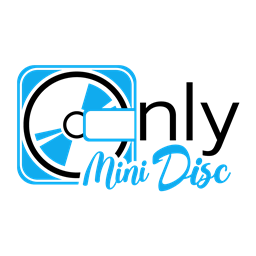

# Only MiniDisc

## [onlyminidisc.com](https://onlyminidisc.com)

## How to run the project locally:
- Fork the main project.
- Clone the project to your computer.
- Run `yarn install`.
- Run `yarn start`.
- Open a browser and navigate to http://localhost:8000.
