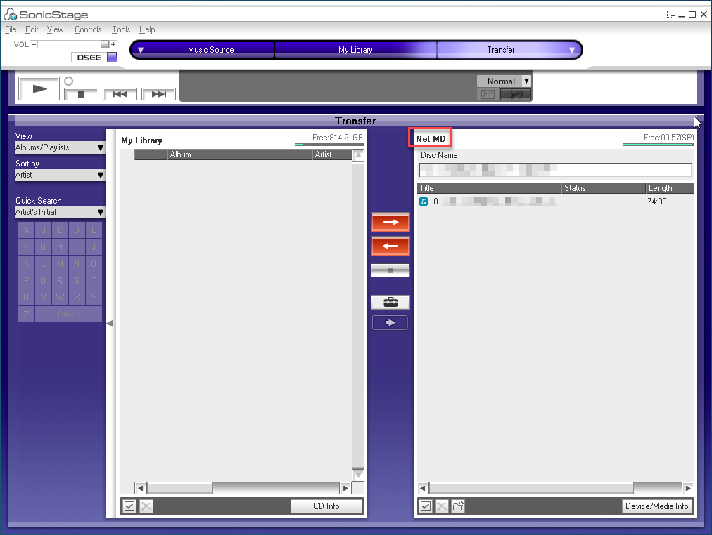
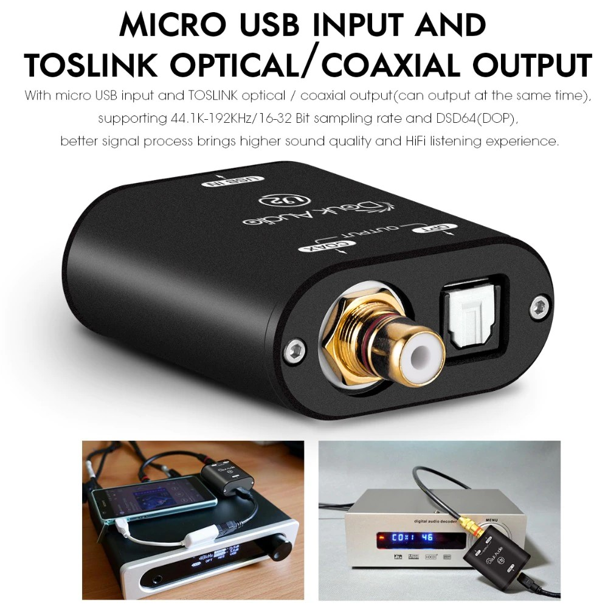

## Advantages of Net MD

ข้อดีของการเขียนเพลงลงแผ่น MD ด้วย Net MD

- ใช้งานได้ง่ายและสะดวก แค่เสียบสาย USB ลง driver ลงโปรแกรมก็ใช้งานได้เลย
  - [คู่มือติดตั้งและใช้งานโปรแกรม SonicStage](/netmd/sonic-stage-manual-manual)
  - [คู่มือใช้งาน Web MiniDisc](/netmd/web-minidisc-user-guide)
- ไม่ต้องซื้ออุปกรณ์เพิ่มเติม เช่น USB to Toslink/Coaxial เพื่ออัดแบบ digital input
- เขียนไวมากๆ เพลง 10 นาทีใช้เวลาประมาณ 45 วินาที
  - [ทดสอบเวลาที่ในการเขียนเพลง MP3 ลงแผ่น MD](/netmd/writing-disc-time-usage-test)
- เรียงลำดับเพลงได้ง่าย แก้ไขลำดับภายหลังได้
- คุณภาพเสียงที่ดี เขียนได้ทั้ง SP, LP2, LP4
- เขียนใน LP2 (132 kbps) mode ได้คุณภาพเสียงดีกว่า MP3 (128 kbps)
- ถ้าเขียนเป็น LP2 mode หนึ่งแผ่น MD จะสามารถเก็บเพลงได้เป็นสองเท่าของ SP mode
- แก้ไขชื่ออัลบัม/ชื่อแผ่นได้เลย พิมพ์จาก keyboard ได้เลย
- ได้ชื่อเพลงมาเลย ไม่ต้องพิมพ์ชื่อเพลงเอง ตอนนี้ยังได้แต่ชื่อเพลงภาษาอังกฤษ
- สามารถเขียนเพลงในรูปแบบ FLAC, WAV, MP3 ได้เลย ได้คุณภาพใกล้เคียงต้นฉบับ
- มีปุ่ม download ที่สามารถ RIP CD ลงแผ่นได้ด้วยการกดปุ่ม Download เพียงปุ่มเดียว (รุ่นที่มีปุ่ม Download: Sony MZ-NE810, Sony MZ-NH3D, Sony MZ-DH10P)

*Note* อย่างไรก็ตาม **Net MD จะใช้ได้เฉพาะเครื่องเล่นที่รองรับ Net MD เท่านั้น**

## SonicStage screenshot
- ภาพตัวอย่างโปรแกรม SonicStage

  

## Web MiniDisc screenshot
- สามารถใช้งานผ่าน web browser ได้เลย ไม่ต้องติดตั้งโปรแกรมลงในเครื่อง
- ภาพตัวอย่างโปรแกรม Web MiniDisc

  

## Relationship between MD recorders that support Net MD technology and Hi-MD recorders
- All MD recorders that support Net MD technology allow us to transfer a music file from a computer or a mobile phone to an MD recorder.
- **All Sony Hi-MD recorders support Net MD technology** but all Onkyo Hi-MD recorders do not.
- MD Recorders that support Net MD technology but not Hi-MD recorders allow us to record in SP, LP2 and LP4 modes only.
- Here is the Venn and Euler diagram that shows the relationship between MD recorders that support Net MD technology and Hi-MD recorders:

  

## USB to Toslink/Coaxial converter
- Douk Audio Mini XMOS USB to SPDIF Coaxial Optical
- XMOS XU208 chip
- เล่นเพลงจาก computer หรือโทรศัพท์มือถือ ต่อ micro USB เข้ากับเครื่องนี้ และ USB อีกฝั่งกับ computer
- ใช้สาย Toslink แบบปกติ ต่อจากเครื่องนี้เข้าเครื่อง MD deck ที่มี Toslink input แล้วก็ทำการอัด 1:1 digital
- รุ่นอื่นที่น่าสนใจ เช่น FiiO K3

  

## CD to MD
การอัดจากแผ่น CD ไปยังแผ่น MD ให้คุณภาพเสียงที่ดี แต่ก็มีข้อจำกัดดังนี้

- ต้องมีแผ่น CD ต้นฉบับที่บางครั้งหายาก และราคาแพง
- แผ่น CD ต้องอยู่ในสภาพที่ดี ถ้าแผ่นมีรอยเพียงเล็กน้อยก็ทำให้อัดเพลงสะดุดได้
