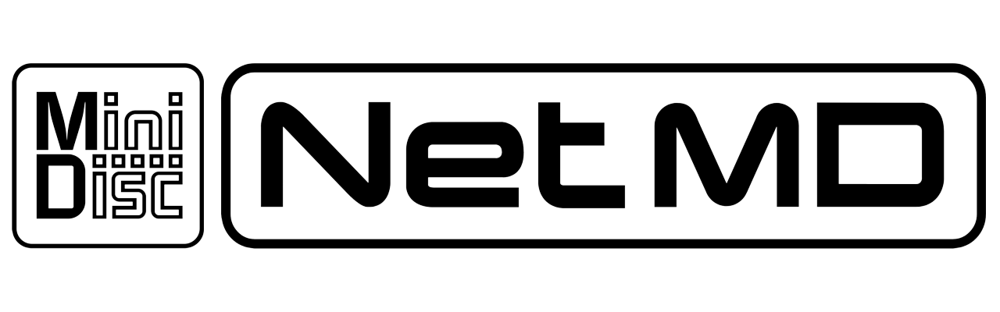
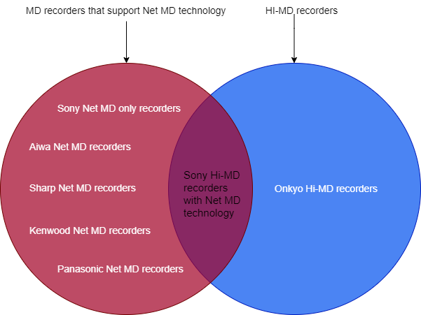
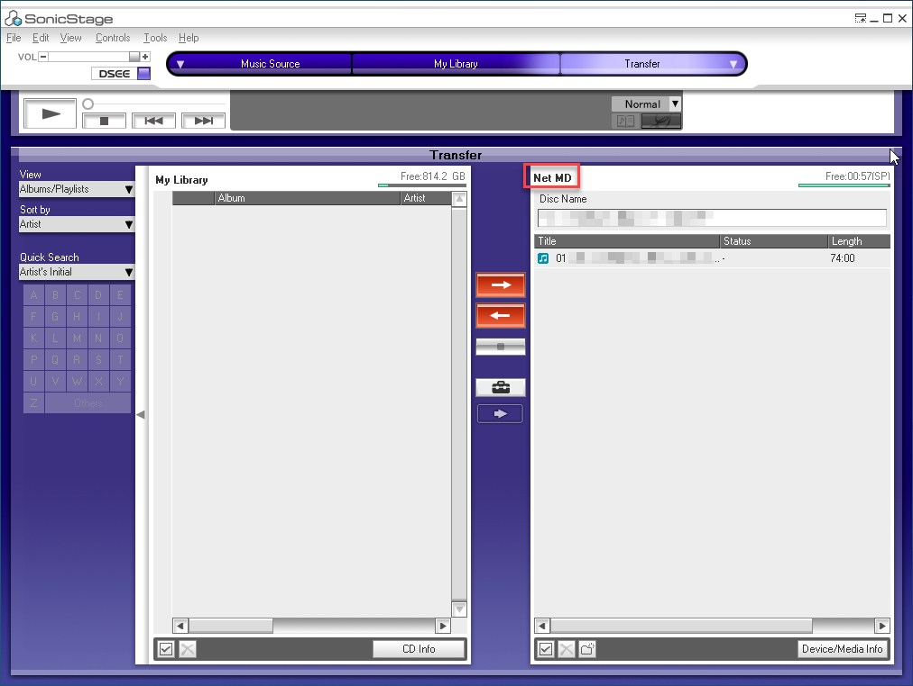
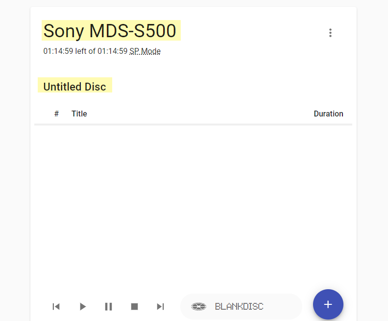

## Advantages of Net MD technology

Advantages of transferring music files to an MD disc with an MD recorder that supports Net MD technology

- It is easy to use and convenient. Plug a USB cable to a computer (Windows, Mac or Linux) or Android phone and use either SonicStage or Web MiniDisc.
  Please follow this [user guide documents](/netmd/web-minidisc-user-guide) for using Web MiniDisc
- You don't need to buy additional equipment such as a USB to Toslink/Coaxial adapter as we do for one to one recording.
- It writes music files to a disc very fast. For example, 4x of an actual song's duration for SP mode, and 16x - 32x for L2 mode.
  For more information, please check [Net MD writing speed test](https://www.minidisc.wiki/guides/netmd-speed-test).
- You get a song title automatically from a music file's metadata.  However, you can edit a song's name immediately after it has been recorded,
  but not only editing the single track title, you can also edit the disc's title.
- It is easy to rearrange songs on a disc or remove an existing song on a disc and add a new song to an existing recorded disc.
- It supports many input music files format e.g. FLAC, AIFF, WAV, and MP3 formats.
- For models that have a Download button, e.g. Sony MZ-NE810, Sony MZ-NH3D, Sony MZ-DH10P,
  we can use MD Simple Burner program and press a download button to RIP CD to MD easily.
- Please note that Net MD feature is only available for some recorders that support Net MD technology.

## Relationship between MD recorders that support Net MD technology and Hi-MD recorders
- Sometimes, we are not sure if a Hi-MD recorder supports Net MD technology or not.
  This is a Venn and Euler diagram which can help us understand the relationship between normal MD recorders that support Net

  

- All MD recorders that support Net MD technology allow us to transfer a music file from a computer or a mobile phone to an MD recorder.
- **All Sony Hi-MD recorders support Net MD technology** but all Onkyo Hi-MD recorders do not.
- MD Recorders that support Net MD technology but not Hi-MD recorders allow us to record in SP, LP2 and LP4 modes only.

## SonicStage screenshot
  

## Web MiniDisc screenshot
  
