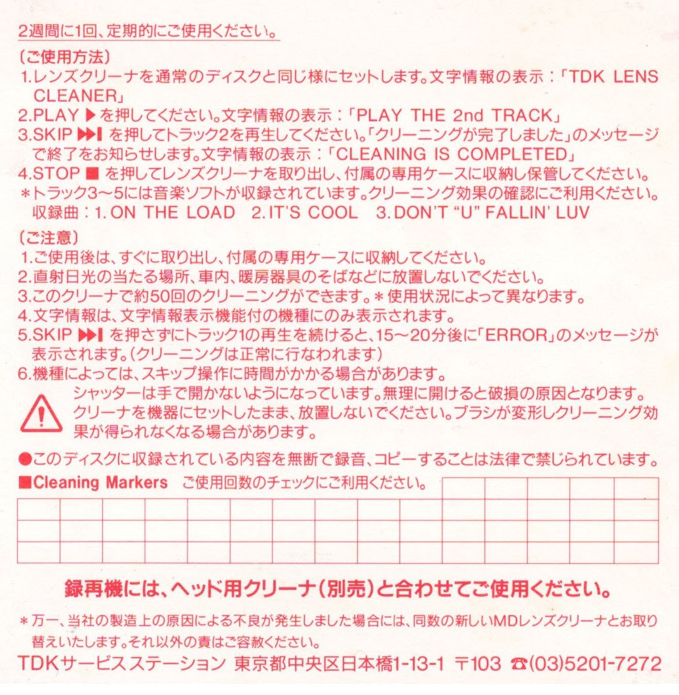
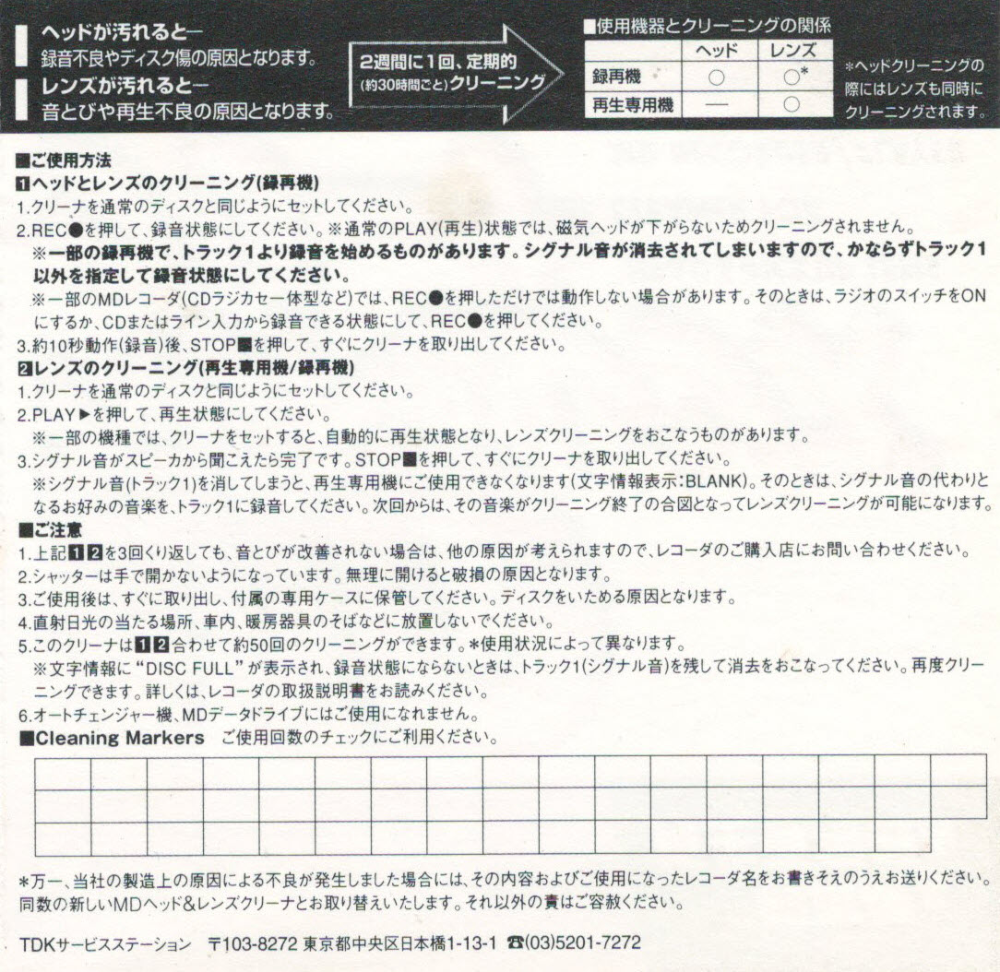

## TDK MD-LC1 instruction
- MD-LC1 supports lens cleaner only (LC stands for lens cleaner)

#### Instruction for TDK Head and Lens cleaners

1. Place the lens cleaner in the player. The player displays [TDK LENS CLEANER].
2. Push the PLAY button. It displays [PLAY THE 2nd TRACK].
3. Push the SKIP button and play the second track. It will display [CLEANING IS COMPLETED] when the cleaning is done.
4. Push the stop button, take the cleaner out. *TRACK 3 through 5 contain music. Use these tracks for verification of cleaning.
  The cleaner contains the following music: 1) On the load, 2) It's cool, and 3) Don't "U" fallin'luv.

**Note**
- It will display [ERROR] after 15 to 20 minutes if you don't push the SKIP button.
  In this case, the cleaning has completed even though a error is displayed.
- The skip operation may take some time depending on the player.

---

## TDK MD-HLC1 manual
-  MD-HLC1 supports both head and lens cleaner only (HLC stands for head-lens cleaner)

#### Instruction for cleaning a recording head by erasing all data in a disc
1. Insert the head cleaner.
2. Push the `MENU` button and click `>>|` or `|<<` to select 'All Erase?'
3. Push the `YES` button to ease and push `YES` button agin to confirm.
4. Wait until to see a `Complete` message which means all data in a disc has been erased.
5. Record music to use for cleaning a lens, start by connecting a recorder to a a music source (line-in).
6. Push the `INPUT` button to select an analog mode.
7. Push the `REC MODE` button to select stereo.
8. Push the `REC` button to enter record mode.
9. Start playing music on a source device.
10. Push the `PLAY` button to start recording.
11. Wait for 20 seconds and push the `STOP` button to stop recording.
12. Eject a disc for TOC written.

#### Instruction for cleaning a lens

1. Insert the head and lens cleaner in a player.
2. Push the `PLAY` button and wait for 20 seconds to finish playing music.
3. Eject the disc and keep it in the case that comes with the cleaner. Do not leave the cleaner in the player after using.

#### Warning
1. Take the cleaner out as soon as you have finished cleaning, and put it into the case that comes together.
  Do NOT leave the cleaner in the player after using. It might deform the brush and lose cleaning effectiveness.
2. Don't keep the cleaner under direct sunlight, in a car, or near a heater.
3. You may use the cleaner up to 50 times (depending on usage).
4. Do NOT open the cleaner with your hands. It might be damaged if you force to open.

## Credit
- Original English instruction translated by Koji Sato from https://www.minidisc.org/
