## MD drives
| Model name  | Model name using similar mechanism | MD mechanism type | Optical pick-up type | Link to buy a part |
|-------------|------------------------------------|-------------------|----------------------|--------------------|
| MDS-NT1     | New                                | MDM-7S2B          | KMS-262E             |                    |
| MDS-S500    |                                    |                   |                      |                    |
| MDS-PC3     | MDS-JE640                          | MDM-7A            | KMS-260B/J1N         |                    |
| MDS-S50     | MDS-S50                            | MDM-7A            | KMS-260B             |                    |
| MDS-JE470   | MDS-S50                            | MDM-7A            | KMS-260B/260E        |                    |
| MDS-JE470   | MDS-S50                            | MDM-7A            | KMS-260B/260E        |                    |
| MDS-JE640   | New                                | MDM-7A            | KMS-260B/J1N         |                    |
| MDS-JE770   | MDS-S50                            | MDM-7A            | KMS-260B/260E        |                    |
| MDS-JE480 * | MDS-JE470                          | MDM-7S1A          | KMS-260B/260E        |                    |
| MDS-JE780 * | MDS-JE480                          | MDM-7S1A          | KMS-260B/260E        |                    |
| MDS-JB920   | MDS-JE520                          | MDM-5A            | KMS-262A/J1N         |                    |
| MDS-JB980 * | MDS-JE780                          | MDM-7S1A          | KMS-260B/260E        |                    |
| MDS-JE500   | New                                | MDM-3A            | KMS-260A/J1N         | [link][1]          |
| MDS-J3000   | MDS-JE500                          | MDM-3A            | KMS-260A/J1N         | [link][1]          |
| CMT-M333NT  | HCD-CP505                          | MDM-7S2D          | KMS-262E             |                    |
| MXD-D5C     | New                                | MDM-7X2A          | KMS-262A/J1N         | [link][2]          |
| MXD-D40 *   | MXD-D5C                            | MDM-7X2A          | KMS-262A/J1N         | [link][2]          |
| CMT-C7NT    | New                                | MDM-7X2B          | KMS-262E             |                    |

* Good players that can share parts or easy to find parts.

[1]:https://alltroniccomputer.com.sg/products/audio-md-optical-pickup-assy-kms260a-mdm-31-md-mechanism
[2]:https://alltroniccomputer.com.sg/products/audio-md-optical-pickup-assy-kms260b-e-mdm-7s2a-md-mechanism

<!-- import MDPlayersPartsSheet from '../../components/MDPlayersPartsSheet'; -->
<!-- <MDPlayersPartsSheet /> -->

## Rubber belts for MD drives
| Inside diameter (mm) | Thickness (mm) | Belt type | For models                      |
|----------------------|----------------|-----------|---------------------------------|
| 19                   | 1.2            | Square    | MDS-NT1, MDS-S500, JE780, JB980 |
| 12.5                 | 1.2            | Square    | LAM-Z05                         |

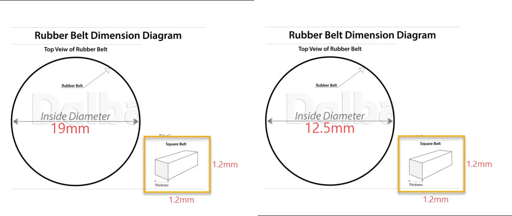

## Power adapters and DC jack diameter
| Original adapter model name | For devices              | Voltage (V) | Current (mA) | Outer diameter jack (mm) | Inner diameter jack (mm) |
|-----------------------------|--------------------------|-------------|--------------|--------------------------|--------------------------|
| Sony AC-ES3010K3            | Sony portable MD players | 3           | 1000         | 2.5                      | 0.7                      |
| Sony AC-96NP                | Sony MDS-NT1             | 9           | 600          | 4.8                      | 1.7                      |
| -                           | Sony MZ-N10              | 6           | 1000         | 4                        | 1.7                      |
| Sony AC-E45HG               | Sony MZ-E40              | 4.5         | 700          | 4                        | 1.7                      |
| SONY AC-ES454               | Sony MZ-R37              | 4.5         | 400          | 4                        | 1.7                      |
| -                           | Sanyo MD-U4 (หมาเนย)     | 9           | 2000         | 4                        | 1.7                      |
| -                           | iRiver iHP100, 120, 140  | 5           | 350          | 3.5                      | 1.35                     |

- For **Sony AC-96NP** jack replacement, we need to find a jack which has a spring inside.

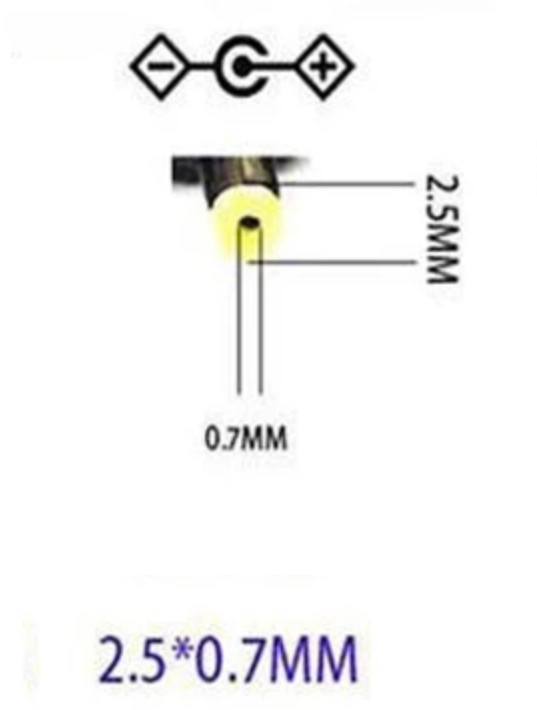
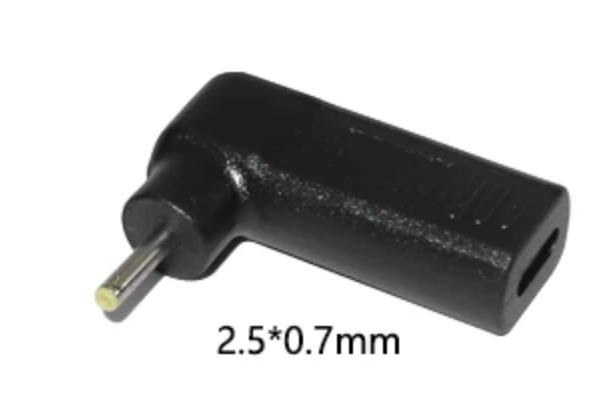
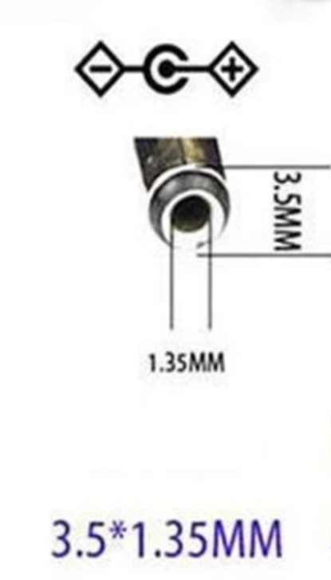

## MP3 players that we can take OLED and use it as MZ-RH1 replacement part
### Matched part number
- NW-S202
- NW-S202F
- NW-S203F
- NW-S205F

### Compatible
- NW-E305
- NW-E307

### Possibly compatible OLED but need to test
- NW-E002F
- NW-E003F
- NW-E005F

## Sidecar battery
- Images of side card battery for Sony portable MD players.
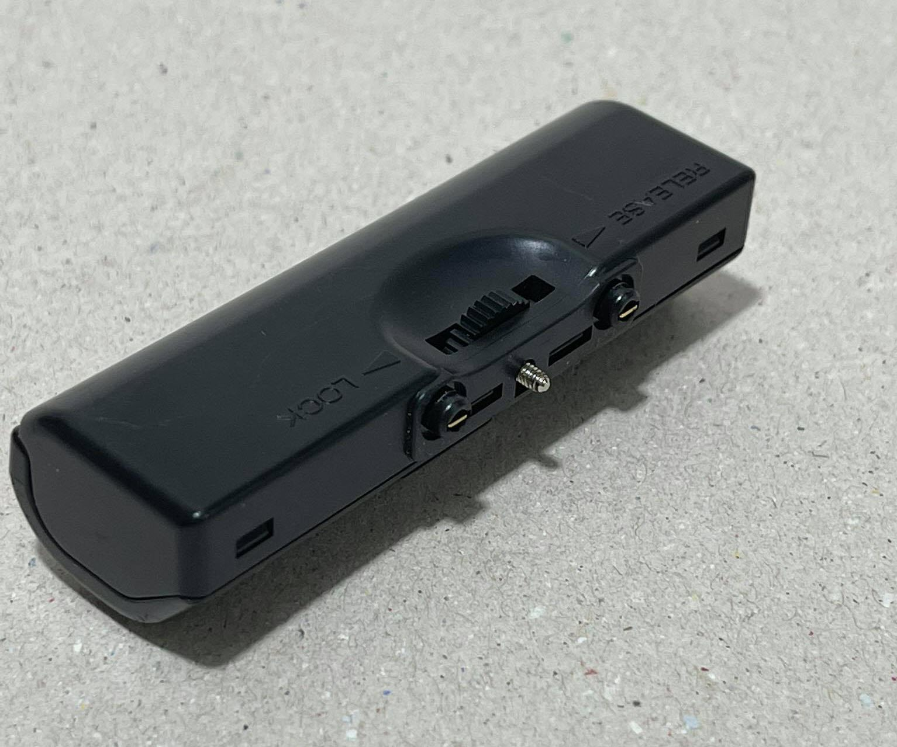
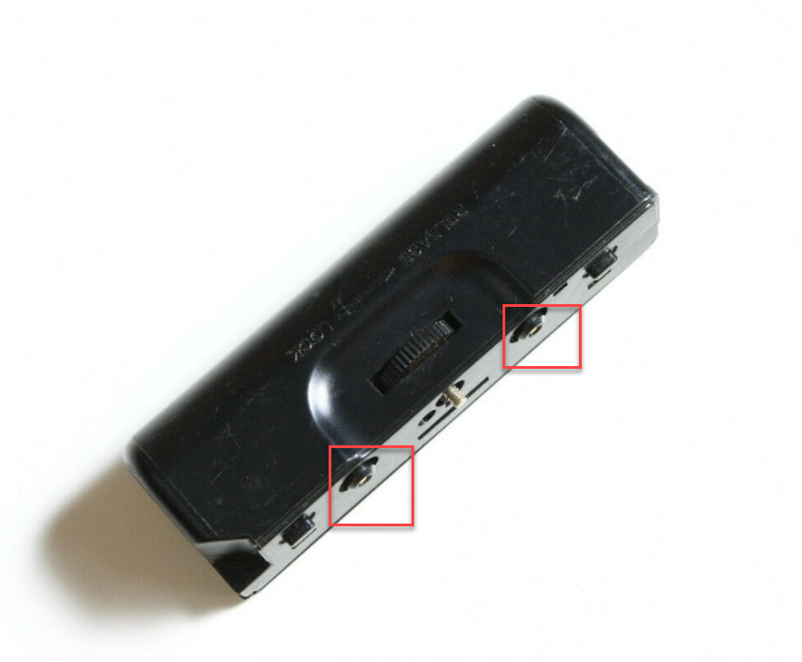
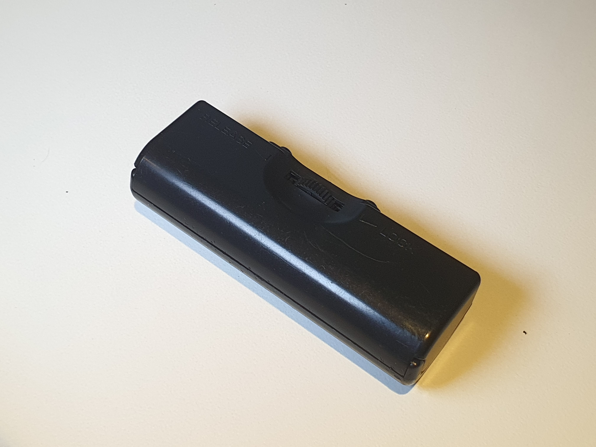
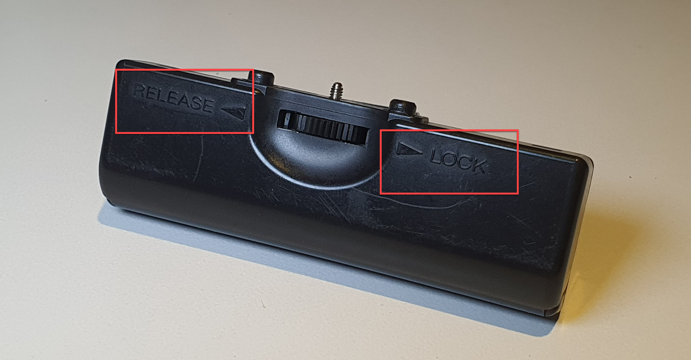
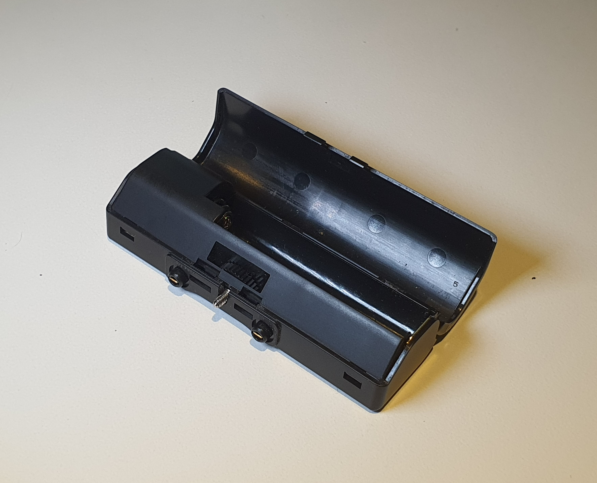
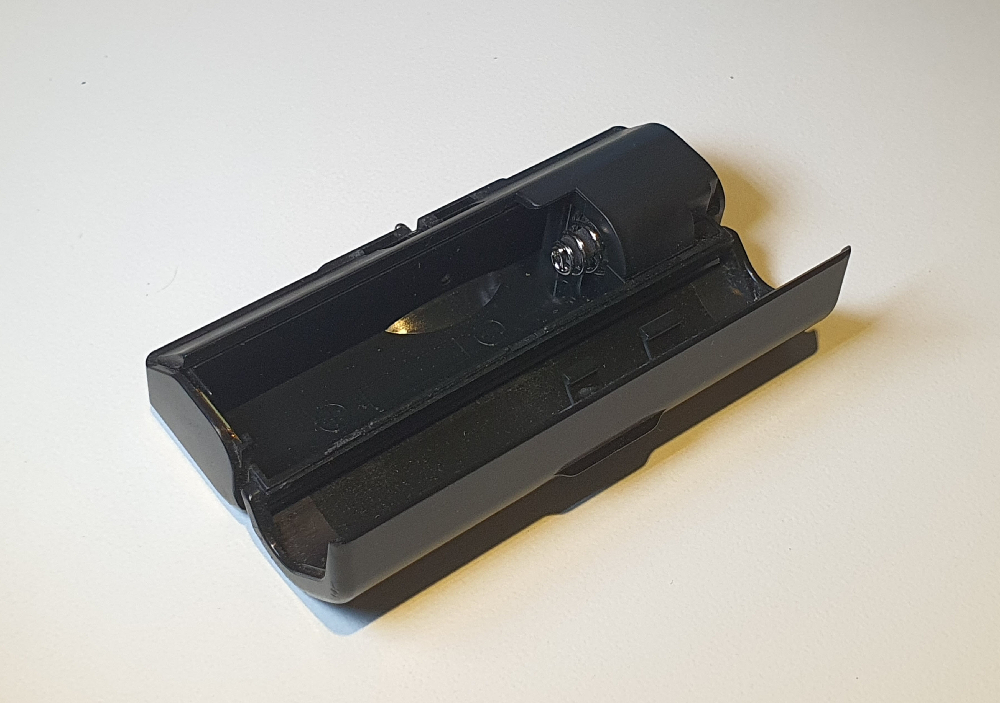
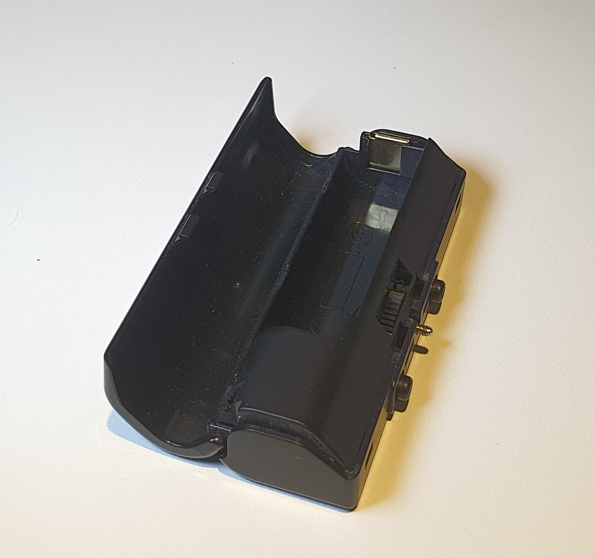
