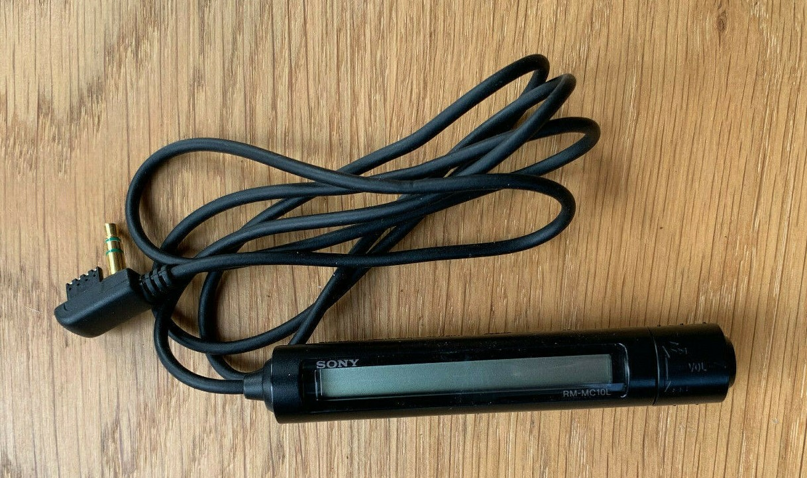
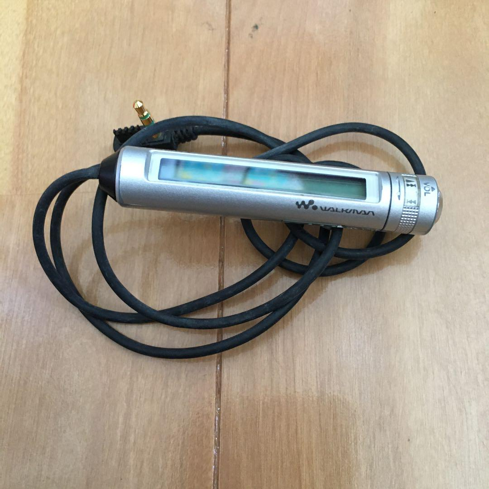
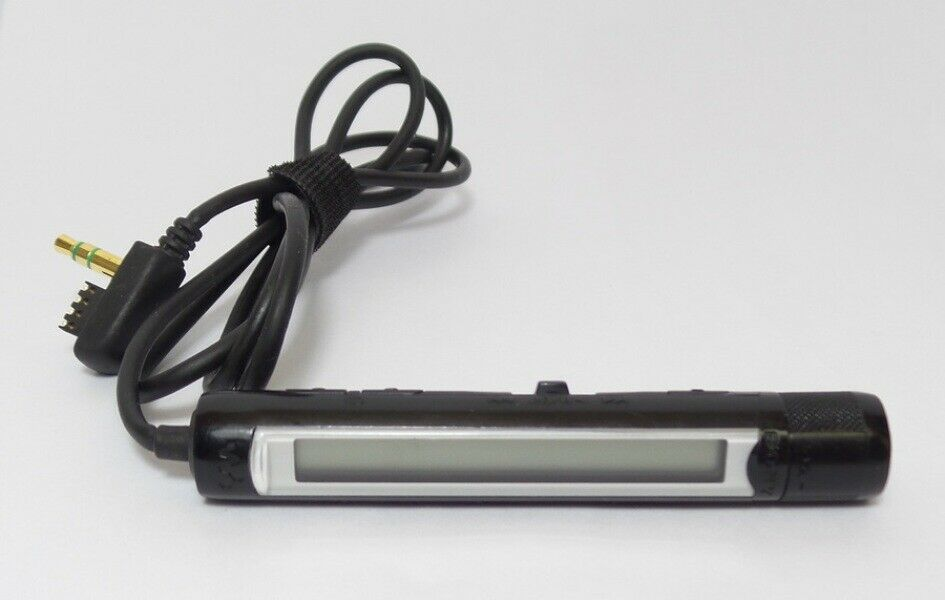
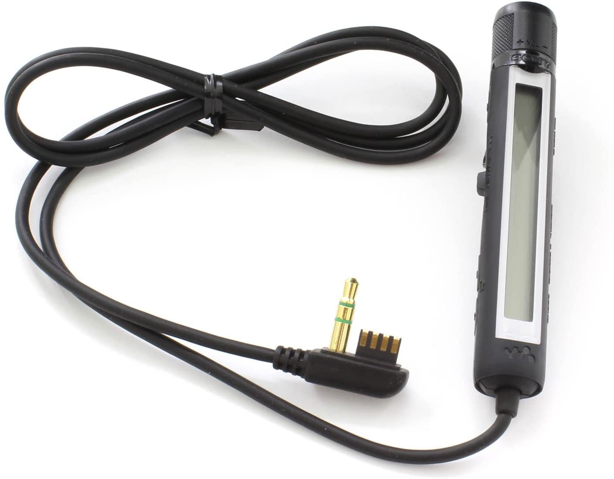
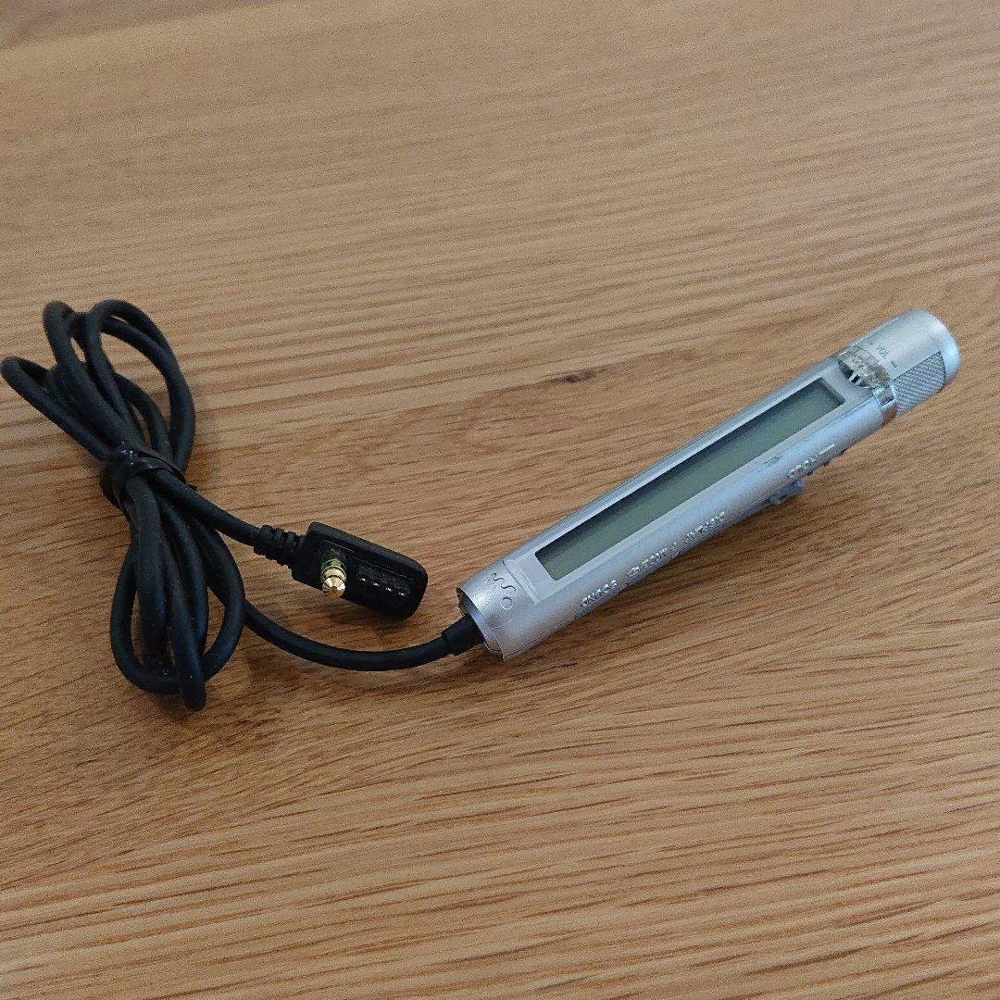

## Sony MD LCD Remotes

### RM-MZ2S
- Supplied with MZ-R90, MZ-R91, MZ-E75, MZ-E90, MZ-E95, MZ-E77, & MZ-E800.
- This is a backlight remote with 9 character display as well as smooth scrolling.
- Buttons on top of remote include display, play mode and pause; hold switch also on top.
- Bottom of remote has volume +/- and a slider switch on the right side; pushing 'up' or 'down' changes tracks | or |;
  rectangular stop button on the side of the slider switch.

### RM-MC10L
- Supplied with MZ-N707A1, MZ-E501, MZ-E500 as well as some CD players. 9 character display w/ smooth scrolling.
- Buttons range from change of display (track/disc title-if any, track time), play modes, repeat, sound mode, pause.
- Special twist knob on top of remote; twisting it 'up' or 'down' changes tracks | or |. pulling it out gives access to volume - and +.
- Circular Stop button on very top of remote on the twist knob. Hold switch opposite of the 5 buttons. NO backlight.

### RM-MC11EL
- Supplied with MZ-R900, MZ-R909, MZ-N1A2, MZ-R910, MZ-E900, MZ-E700, MZ-E707, MZ-E909A3, MZ-E505 as well as some CD players.
- All features are same on RM-MC10L, except w/ backlight.

### RM-MC12ELK
- Supplied with MZ-E909A3, MZ-N1A2. Revamped version of the famous RM-MC11EL now has the ability to display kanji characters, 6 character displays.
- Roman characters are very blocky and jerked scrolling.
- Headphone jack now moved to top of remote where stop button used to be.
- Stop button now moved to row of buttons.
- 6 buttons on one side hold switch on the other.

### RM-MC30L
- Supplied with D-EJ885. 9 character display. This remote is a revamped version of the 11EL/12ELK remote.
- Buttons on the side include display, play mode/repeat, and sound and hold switch. Opposite site now has the stop button.
- Navigation has moved off the twist knob and a new 'shuttle switch' is placed next to the stop button in where pushing it in will play (activate CD player), and pause.
- Moving the switch to the right will advance to the next track, and moving it to the right will go back one track.
- Volume + and - are still located on the twist knob. Removable alligator clip. NO BACKLIGHT

### RM-MC32EL
- Supplied with D-EJ2000, D-EJ985 CD players.
- Same features as the RM-MC30L but with backlight

### RM-MC32ELK
- Same features as the RM-MC32EL but with backlight and kanji/kana display.

### RM-MC33L
- Supplied with MZ-N710.
- Features are the same as 30L. NO backlight.
- To the right of shuttle switch has two 'folder' + and - buttons to go to quick access to multiple groups (if any) on the disc.

### RM-MC33EL
- Supplied with MZ-E710, MZ-E610 MZ-E510, MZ-E810SP MZ-E620, MZ-E720, MZ-N10 (NA/EU), MZ-N910 (EU), et al.
- Features are the same as RM-MC33L but with backlight.
- *Please note: the MC33EL is 100% compatible with all 1st and 2nd generation HiMD units.
- Other supported devices: MZ-E730

### RM-MC35ELK
- Supplied with MZ-N10 (JP), MZ-NE810, MZ-N910 (JP), MZ-N920, MZ-RH1 (JP) and MZ-RH10 (JP)*. (*Color matching RM-MC35ELK comes bundled only with the MZ-RH10 (JP))
- Features are the same as RM-MC33EL but with improved kanji/kana display and higher resolution. Narrower text allows 12 (roman) character displays.
- Scrolling is 1 character at a time rather than 1 pixel at a time; special 2-line display can display disc or group name at the top,
  and track title at the bottom (only compatible with NetMD units mentioned above); special animations show up when starting up MD, or accessing various sound modes.
- *Please note: the MC35ELK is 100% compatible with all 1st, 2nd and 3rd generation Hi-MD units.
- Other supported devices: MZ-E730

### RM-MC33ELU/RM-MC35ELKU
- Fitted exclusively for the MZ-E10 (NA/EU, JP). same features as the 33EL/35ELK, except for a special mini-plug fitted due to the thinness of the E10

### RM-MC38EL
- Supplied with MZ-NH900 (NA) and MZ-RH1. Same features as the 33EL, with the addition to a Hi-MD input on the LCD.
- *Please note: the MC38EL is 100% compatible with all other 1st and 2nd generation Hi-MD units.

### RM-MC40ELK
- Supplied with MZ-NH700 (WM), MZ-NH900 (WM), MZ-NH1 (JP), & MZ-NH3D (JP).
- The RM-MC40ELK is a new style 3 line high-resolution LCD remote with kanji/kana text support.
  1st line displays group/disc info, 2nd line displays track number and time elapsed. Narrow text allows 12 character (roman) displays on 3rd line.
- Special rocker switch at the bottom of remote allows browsing tracks ||, || function when pushed in, from the right is the stop/cancel button, and volume +/- buttons.
- There's a jog dial on the front of the remote; allowing menu functions, et al.
- *Please note: the MC40ELK is 100% compatible with the 2nd generation HiMD units.

### RM-MC51EL
- Supplied with the D-EJ720 and physically identical to both the RM-MC53EL and RM-MC55ELK.
- The RM-MC51EL has backlight option but lacks multi-language character display.
- In comparison to the RM-MC55ELK, the RM-MC51EL has only track navigation of up and down on the right side of the twist knob
  and a light button in place of the a search   button found on the RM-MC55ELK. Unfortunately, the a light button does not work with Hi-MD/MD units.

### RM-MC53EL
- Supplied with D-NE720, D-NE820. The RM-MC53EL has backlight option and is identical to the 55ELK (below), except it lacks multi-language character display.
- *No other known information for this remote

### RM-MC55ELK
- Supplied with D-NE920, D-NE20. The RM-MC55ELK has backlight option and supports kanji/kana, hangul (korean) character compatibility,
  16-18 roman character display and 9 multi-language character display.
- It has special animations when starting-up MD, and accessing/editing sound-modes.
- "scroll-type" level w/ corresponding button on the left side of remote allows quick access of functions such as sound, menu, play mode, et al.
- Right side has new 'search' button. Volume knob +/- is separate from reverted-style of the +/- group folder, || twist knob;
  twist knob similar to 11EL rocker switch - group folder: left, ||: right.
- Stop and play/pause button below 'search' button. New-style 360A  alligator clip. HOLD switch to the left of the clip.
- *the 55ELK is quite possibly the most technical remote in terms of features, improved LCD, and ergonomics.

### RM-MC60/RM-MC61
- Supplied with US, AEP, and UK models of MZ-DH10P, MZ-RH10, MZ-RH910 (MZ-RH910 of non-Asian version comes bundled with the MC61) and MZ-RH710.
- *The MC60 is a non-LCD remote with basic functions for Hi-MD functions; black and silver color theme.
- The MC61 - grey and white color scheme.

### Qualia 017 remote
- Supplied with the Qualia 017. This remote is based on the 35ELK, except with sleek lines and encased in polished, shiny steel.
- *No known information for this remote.

---
## Sony MD Tuner Remotes:

### RM-MZ1T
- Supplied with the MZ-G750, and MZ-G755. This remote provides quick access to volume controls, radio functions and navigation.
- The radio option is ONLY functional with G755 and G750. However, is provides no text and only display track time and track #. NO backlight

### RM-MC36(37)LT
- Supplied with the MZ-NF610, MZ-NF810, and MZ-NF520 and D-FJ787. This remote has AM/FM (TV/Weather - US only) enabled.
- It is basically a revamped tuner remote with 9 character display. The RM-MC36(37)LT provides access to menu (via display), play modes, and sound mode.
- Volume control is located to the left of shuttle switch. The stop button and group +/- folder buttons to the right of shuttle switch
  and the radio on/off function is located next to the LCD.
- The remote does NOT support backlight.
- In addition, the tuner remote is ONLY functional with NF610 and NF810 and D-FJ787; cannot work (nor fit) in the remote jacks of other units.

### RM-MC39LT
- Supplied with MZ-NHF800. The 39LT has the same features as the 37LT, with addition to the Hi-MD input on the LCD.

----
## Sony MD Car Rotary Remote Commander

### RM-MC25C
The MC25C is a non-LCD rotary car remote commander with basic playback functions; should be compatible with all known MD units.

---

- A1 European/World N707 only (10L), North American model (MZ4R)
- A2 North American/European/ N1 only (11EL), Japanese model (12ELK)
- A3 North American/European E909 only (11EL), Japanese model (12ELK)

## Credit
- Original content from SonyInsider forum [A Guide To Sony LCD Remotes
](https://forums.sonyinsider.com/topic/11679-a-guide-to-sony-lcd-remotes/)
- Remotes' images for reference only, not for commercial. Credit images from:
  - amazon.com,
  - mercari.com,
  - ebay.com
  - [Yahoo Action Japan](https://auctions.yahoo.co.jp/)

