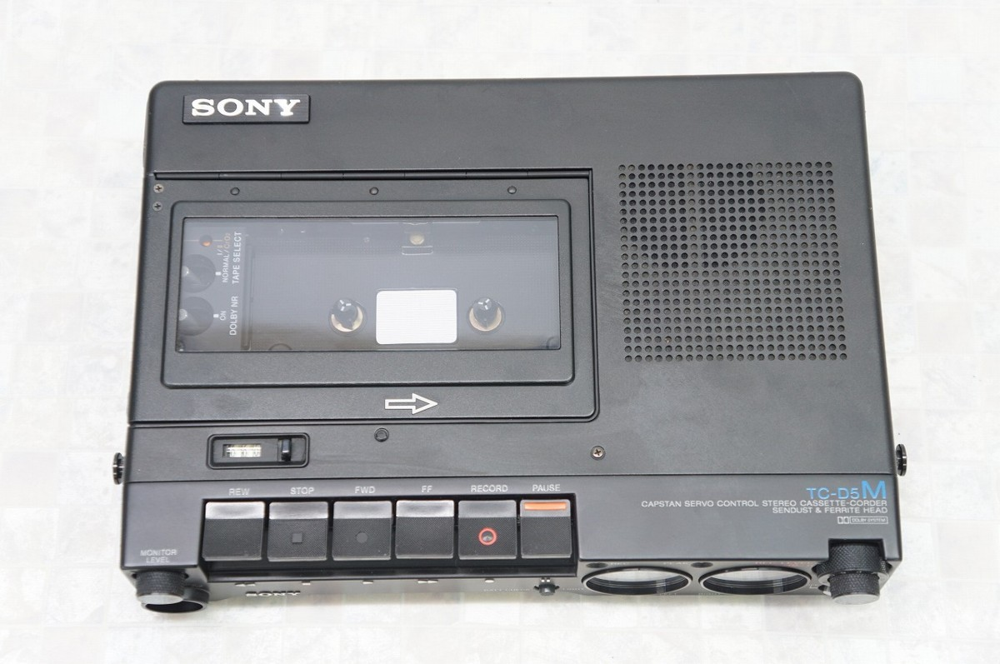
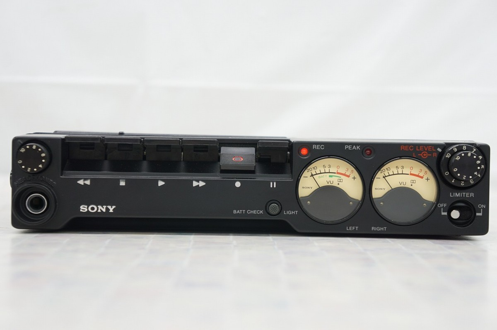
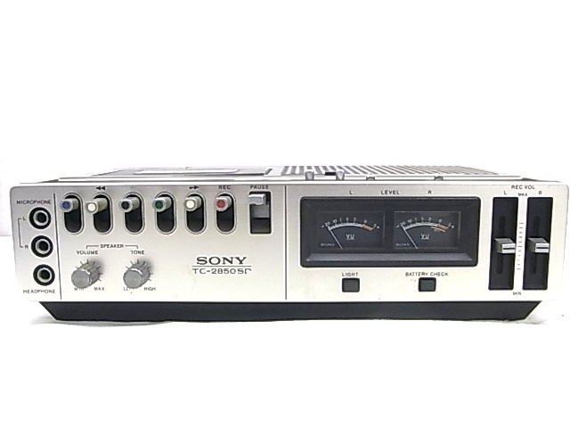
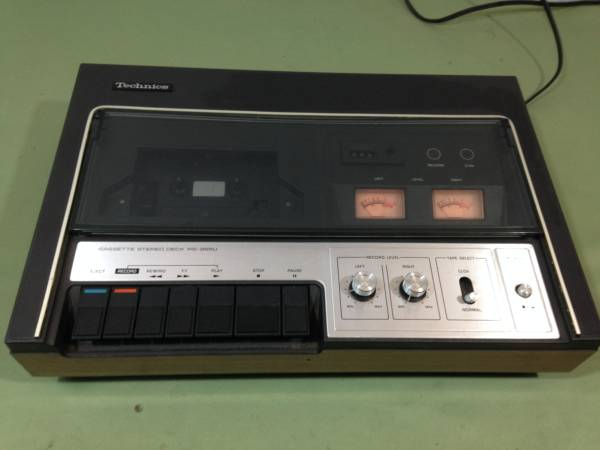
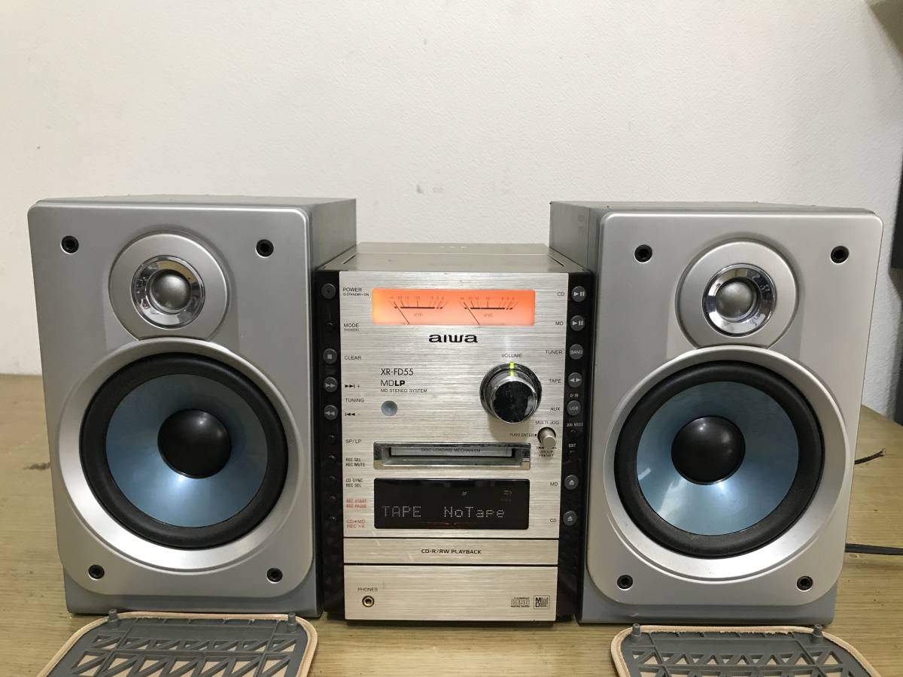
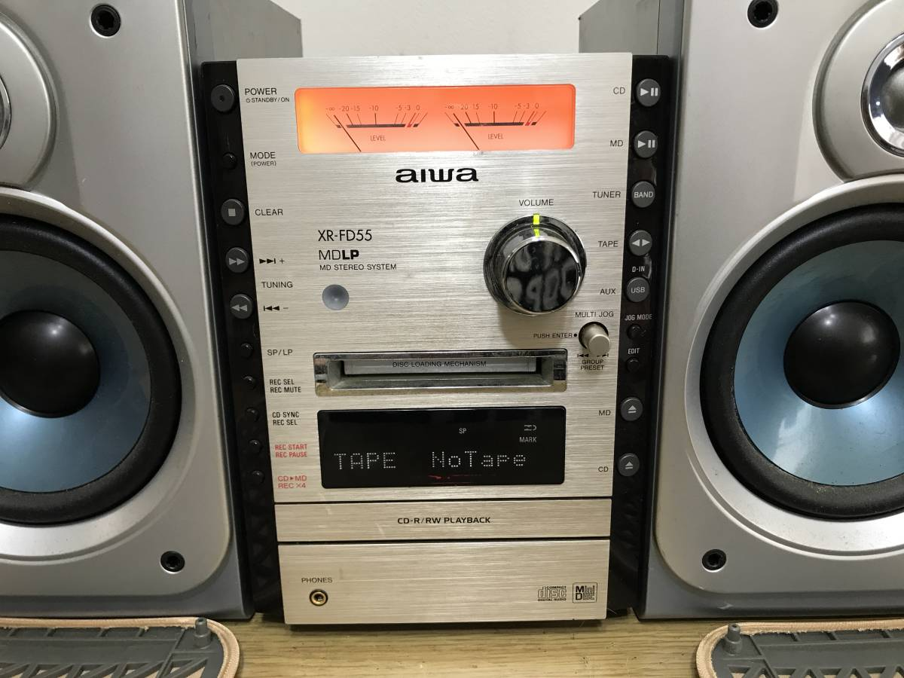

##  Technics Stereo cassette deck 615
👇

## Sony TC-D5M
👇

## Sony TC-2850
👇

## Technics​ RS-265U
👇

## Aiwa XR-FD55
👇

# Credit
- Images here just for study/reference and not for commercial
- Credit images from
  - Yahoo Auction Japan
  - Khun Chalermphol

