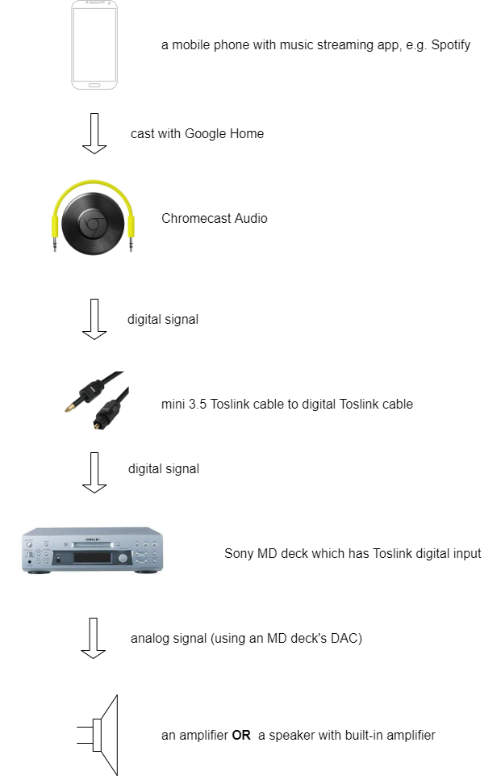

## Main idea
- Use a Google Chromecast Audio device to get digital input to an MD deck.
- Use **DAC** in an MD deck to get analog output.
- On an MD deck, select digital input. Press record on it and start playing a source. No need to insert an MD.
  The display shows "XX -DA", indicating that the unit's DAC is in use.

## Workflow diagram

## Credit
- [Using MD deck as DAC post from SonyInsider forum](https://forums.sonyinsider.com/topic/26820-using-md-deck-as-dac/)

