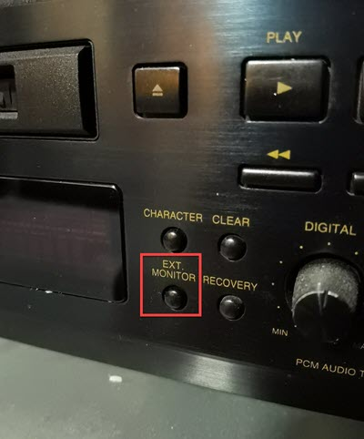

## Main idea
- Use a Google Chromecast Audio device to get digital input to an MD deck.
- Use **DAC** in an MD deck to get analog output.
- On an MD deck, select digital input. Press record on it and start playing a source. No need to insert an MD.
  The display shows "XX -DA", indicating that the unit's DAC is in use.

## Supported MD decks
- Here are some tips to help you identify if we can use a deck as DAC.
  - All Sony MD decks support this feature, just press REC and no need to insert a disc.
  - For other brands, they must have something like **EXT MONITOR** button to support this feature.
    If a model does not have **EXT MONITOR**, we need to insert a disc, press **REC** and **PAUSE** buttons but a disc is still running which is not what we expect.

the Denon deck which has **EXT MONITOR** button

## Workflow diagram

## Alternative options

### Use Chromecast with HDMI Audio Splitter
- สำหรับท่านที่มี Chromecast อยู่แล้ว สามารถหาอุปกรณ์ที่เรียกว่า HDMI Audio Splitter มาใช้ร่วมกันได้ เพราะ Chromecast Audio ในไทยหายากมากๆ คือไม่มีเลย
- ตอนนี้ที่ต่างประเทศ ราคาขึ้นมากๆ ผมก็ไม่ทราบเหตุผลแน่ชัด
- ทราบว่า Google เลิกผลิตไปแล้ว แต่ไม่แน่ใจว่าเนื่องจากมีผู้ใช้เพิ่งค้นพบว่ามันสามารถใช้ทำ music streamer ราคาถูกใช่หรือไม่
- อย่างไรก็ตาม ผมมี concern เล็กน้อยดังนี้
  - ต้องต่อ power เพิ่มอีกตัว
  - ระบบ split HDMI ก็คงไม่มีปัญหาอะไรกับข้อมูล เพราะทุกอย่างน่าจะ digital หมด แต่ผมก็ไม่ทราบกว่ากลไกการทำงานข้างหลัง จะมี chip อะไรเกี่ยวข้องเพิ่มเข้ามาบ้าง
  - ถ้า cast ปยัง TV และเครื่องเสียงพร้อมกันจะเป็นยังไงบ้าง ตัว output ของเสียงน่าจะออกทุกช่องทาง (HDMI, Toslink, 3.5) หรือไม่ แต่คิดว่าทั่วไปคงไม่ทำกัน
- ภาพตัวอย่าง HDMI Audio Splitter

  

  

## Credit
- [Using MD deck as DAC post from SonyInsider forum](https://forums.sonyinsider.com/topic/26820-using-md-deck-as-dac/)
- Support MD decks tips from [Jeff Phyakul](https://www.facebook.com/jeff.richy.52)

