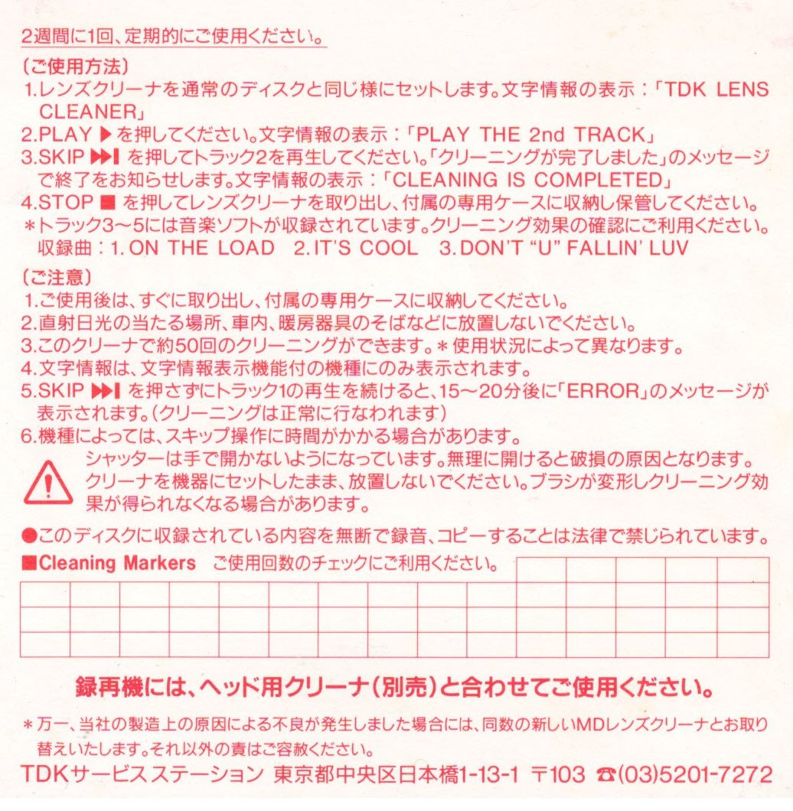
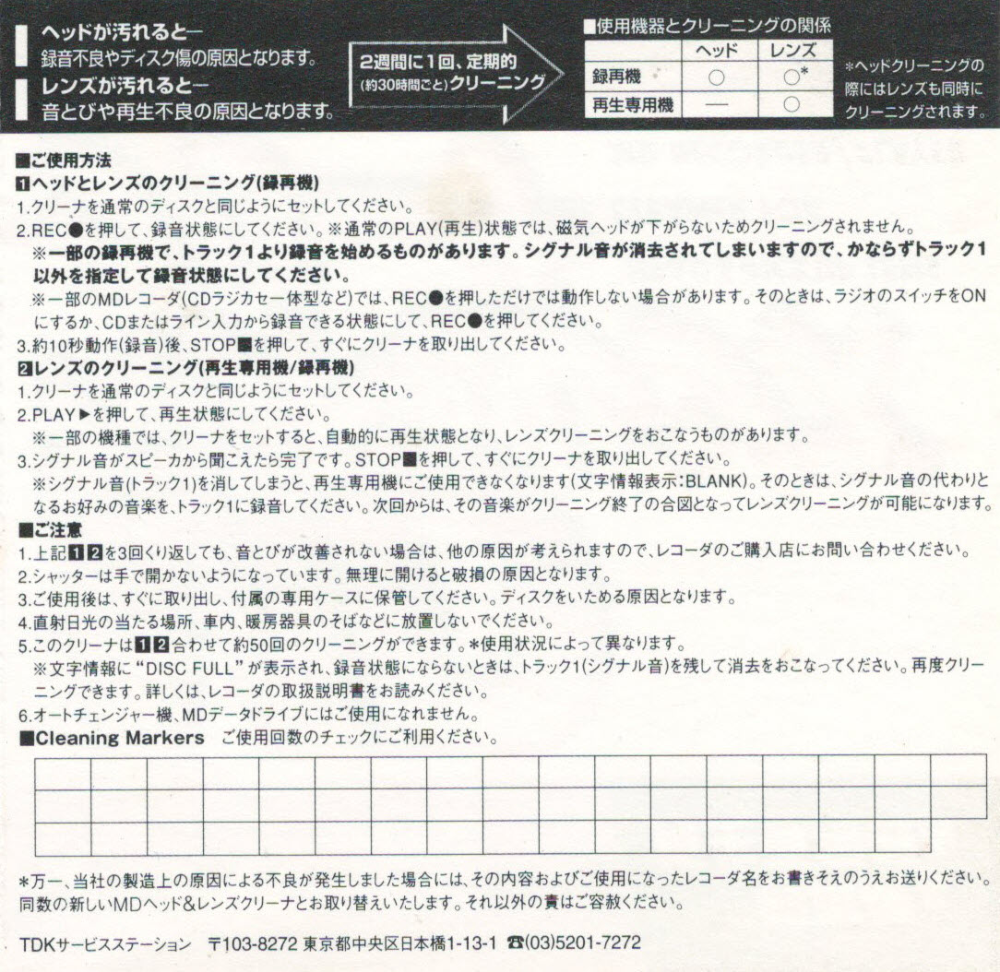

## MD-LC1 instruction

### English instruction translated by Koji Sato

Credit https://www.minidisc.org/

#### Instruction for TDK Head and Lens cleaners

1. Place the lens cleaner in the player. The player displays [TDK LENS CLEANER].
2. Push the PLAY button. It displays [PLAY THE 2nd TRACK].
3. Push the SKIP button and play the second track. It will display [CLEANING IS COMPLETED] when the cleaning is done.
4. Push the stop button, take the cleaner out. *TRACK 3 through 5 contain music. Use these tracks for verification of cleaning.
  The cleaner contains the following music: 1) On the load, 2) It's cool, and 3) Don't "U" fallin'luv.

#### Warning
1. Take the cleaner out as soon as you have done cleaning, and save the cleaner into the case that comes with the cleaner.
2. Don't keep the cleaner under direct sunlight, in a car, or near a heater.
3. You may use the cleaner up to 50 times (depending on usage).
4. The display is shown only on players which have display capability.
5. It will display [ERROR] after 15 to 20 minutes if you don't push the SKIP button.
  In this case, the cleaning has completed even though a error is displayed.
6. The skip operation may take some time depending on the player.
7. ! Do NOT open the cleaner with your hands. It might be damaged if you force it open. Again, do NOT leave the cleaner in the player after use.
  It might deform the brush and lose cleaning effectiveness.

---

#### Instruction for Recording head cleaner
1. Insert the head cleaner.
2. Push the RECORD button.
  - It won't work if you just push the PLAY button.
  - For some MD recorders with a radio, the Instruction may not be cleaned even though you push the record button.
    In this case, turn on the radio or prepare to record from CD or line input, then push the record button.
3. Push the stop button after approx. 10 seconds, and take the cleaner out.

#### Warning
1. Take the cleaner out as soon as you have finished cleaning, and put the cleaner into the case that comes with the cleaner.
2. Don't keep the cleaner under direct sunlight, in a car, or near a heater.
3. You may use the cleaner up to 50 times (depending on usage).
4. It cannot be used for cleaning for play-only player.
5. Do NOT open the cleaner with your hands. It might be damaged if you force to open. Again, do NOT leave the cleaner in the player after use.
  It might damage the cleaner. Return to the MiniDisc Community Page.

## MD-HLC1 manual

