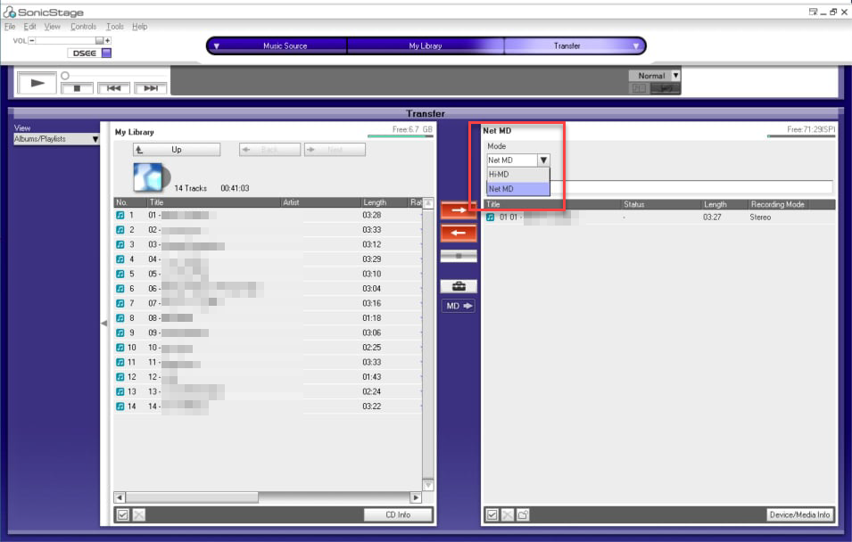

##  MD recording mode
MD recording mode ต่างๆ สำหรับเครื่องที่รองรับ MDLP (MD Long play)

- SP => Standard play (bit rate 292 kbps)
- LP2 => Long play 2 (bit rate 132 kbps)
- LP4 => Long play 4 (bit rate 66 kbps)

## Details of each mode
รายละเอียดของแต่ละ mode

- **SP** เก็บข้อมูลในรูปแบบ ATRAC (Adaptive Transform Acoustic Coding) มีบิตเรตที่ 292 kbps
  แผ่น MD หนึ่งแผ่นจะเก็บเพลงได้ที่ความยาวประมาณ 60, 74, 80 นาที ขึ้นอยู่กับชนิดของแผ่น

- **LP2** เก็บเพลงได้นานขึ้น จากแผ่น 80 นาที ไปเป็น 160 นาที/แผ่น โดยเก็บที่บิตเรต 132 kbps ในรูปแบบข้อมูล ATRAC3
> 👉 เก็บเพลงได้เพิ่มขึ้น 2 เท่าจาก SP

- LP4 เก็บเพลงได้นานขึ้น จากแผ่น 80 นาที ไปเป็น 320 นาที/แผ่น โดยใช้บิตเรตที่ 66 kbps ในรูปแบบข้อมูล ATRAC3
> 👉 เก็บเพลงได้เพิ่มขึ้น 4 เท่าจาก SP

## How to change recording mode in SonicStage (Net MD)
การเปลี่ยน recording mode ในโปรแกรม SonicStage

- โดยปกติ ผมจะ copy เพลง MP3 ลงแผ่น MD ด้วยเครื่องเล่นที่รองรับ Net MD ผ่านโปรแกรม SonicStage ที่ใช้ได้กับ Windows 10
- เปลี่ยน recording mode ด้วยขั้นตอนดังในรูป (เราสามารถเปลี่ยน recording mode ได้ หลังจากเชื่อมต่อเครื่องเล่นเข้ากับเครื่องคอมพิวเตอร์แล้วเท่านั้น)

## How to change recording mode in SonicStage (Hi-MD)
การเปลี่ยน recording mode (Hi-MD) ในโปรแกรม SonicStage

- เชื่อมต่อเครื่องเล่น Hi-MD เข้ากับคอมพิวเตอร์
- ใช้งานได้กับเครื่องเล่น Hi-MD ที่รองรับการอัดเพลงผ่าน SonicStage เท่านั้น
- รุ่นที่รองรับมีดังนี้ Sony CMT-AH10, Sony LAM-X1, Sony MZ-DH10P, Sony MZ-NH1, Sony MZ-NH3D, Sony MZ-NH600/MZ-NH600D/MD-HUSB, Sony MZ-NH700/MZ-NHF800,
  Sony MZ-NH900, Sony MZ-RH1/MZ-M200, Sony MZ-RH10/MZ-M100, Sony MZ-RH710/MZ-DH710, Sony MZ-RH910/MZ-M10
- เริ่มจากเปลี่ยนแผ่น MD ธรรมดาเป็น Hi-MD mode (เราสามารถใช้แผ่น Hi-MD โดยตรง)
- ภาพตัวอย่างการเปลี่ยนแผ่น MD ธรรมดาเป็น Hi-MD mode

  

- เปลี่ยน bit rate ด้วยการคลิกที่ปุ่ม toolbox แบบเดียวกับการอัด Net MD ปกติ
- เลือก bit rate สูงสุดที่ 352 kbps

  

- เมื่อเปิดแผ่นด้วยเครื่องเล่น Hi-MD จะแสดงข้อมูลเพลงในรูปแบบ `Hi-SP` mode **และไม่สามารถเล่นได้กับเครื่องเล่นที่รองรับเฉพาะ SP และ MDLP**
- เมื่อเปิดแผ่นด้วยโปรแกรม Platinum MD จะแสดงข้อมูลเพลงในรูปแบบ `AT3+` mode

## Additional useful information
ข้อมูลเพิ่มเติมที่มีประโยชน์

- [คู่มือติดตั้งโปรแกรม SonicStage 4.3 สำหรับ Windows 10 64-bit](/net-md/sonic-stage-manual-installation-manual)
- [คู่มือใช้งาน Web MiniDisc](/net-md/web-mini-disc-user-guide)

## Credit
- คุณ [Puwanai Mahachinorot](https://www.facebook.com/pinghitz) ที่ได้ให้ไอเดียเพื่อเขียนบทความนี้
