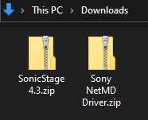
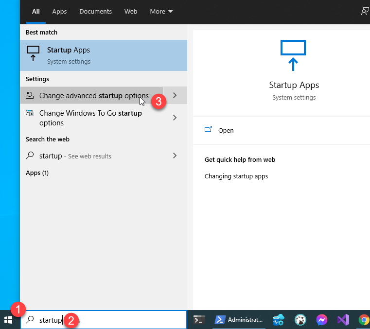
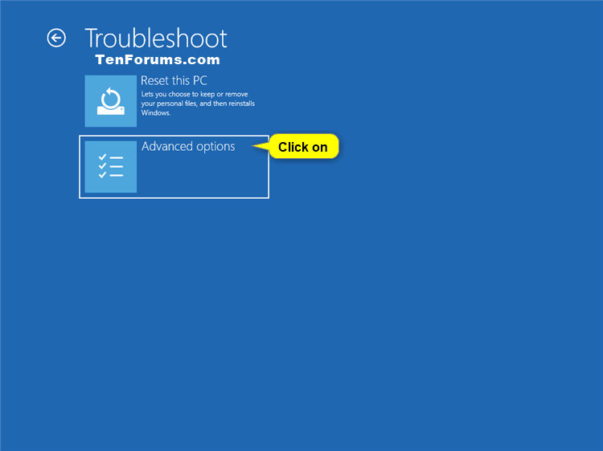
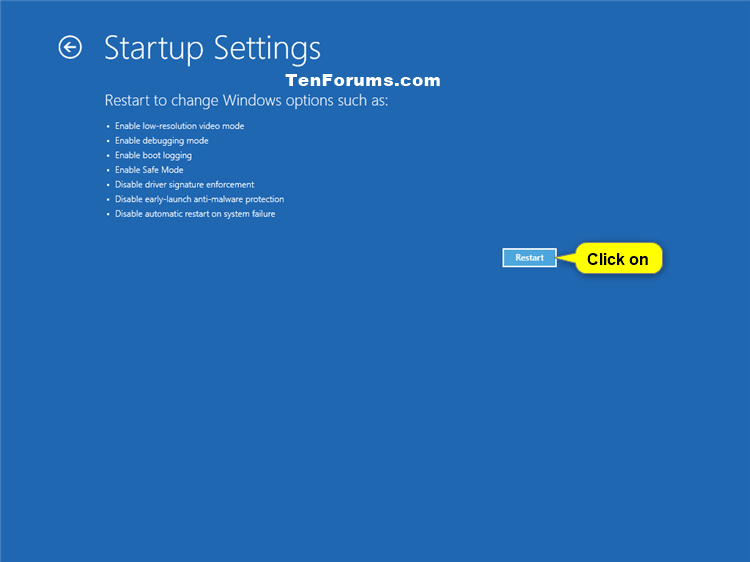
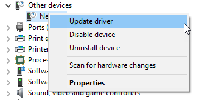
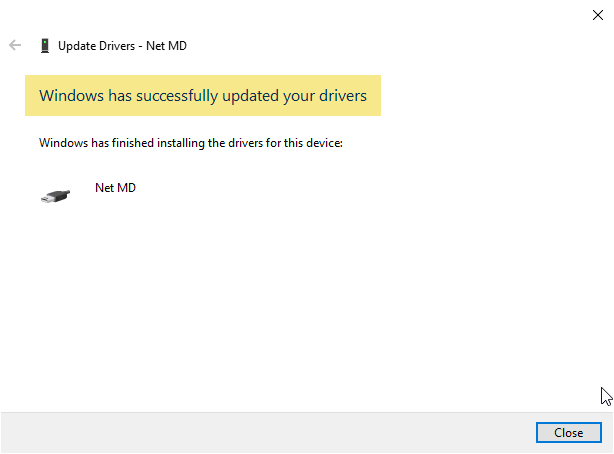
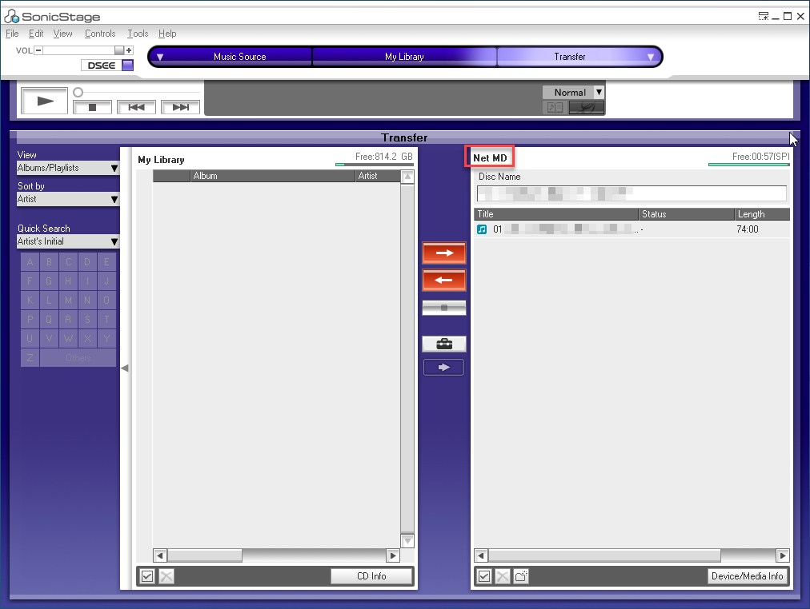

## 1. เตรียมโปรแกรม และไดร์เวอร์

- ดาวน์โหลดโปรแกรม SonicStage 4.3 [💾คลิกที่นี่เพื่อดาวน์โหลด](files/SonicStage-4.3.zip)
- คลิก Download anyway (อาจจะต้องคลิกสองครั้ง)


- ดาวน์โหลดไดร์เวอร์ 64 bit [💾คลิกที่นี่เพื่อดาวน์โหลด](files/Sony-NetMD-Driver.zip)

*ภาพแสดงทั้งสองไฟล์ที่โหลดลงมาเก็บในครื่องคอมพิวเตอร์ที่โฟล์เดอร์ Downloads*



- Unzip แตกไฟล์ SonicStage-4.3.zip และ Sony-NetMD-Driver.zip

*โครงสร้างไฟล์ชองโฟล์เดอร์ SonicStage-4.3*
```sh
└───SonicStage-4.3
│   ├───Common
│   ├───Device
│   ├───Resource
│   └───SonicStage
│   DSetup.dll
│   ExtendSs.dll
│   SetupSS.exe 👈 ไฟล์สำหรับติดตั้งโปรแกรม
│   SetupSS.ini
```

*โครงสร้างไฟล์ของโฟล์เดอร์ Sony-NetMD-Driver*
```sh
└───Sony-NetMD-Driver
│   netmd760.cat
│   NETMD760.inf
│   NETMD760.sys
```

## 2. ติดตั้งโปรแกรม SonicStage
- เข้าไปในโฟล์เดอร์ SonicStage-4.3 ที่แตกมาแล้ว ดับเบิ้ลคลิก SetupSS.exe เพื่อทำการติดตั้งโปรแกรม
- คลิกปุ่ม **Next** หรือ **Yes** ไปเรื่อยๆ จนถึงหน้าสุดท้าย **จะมีข้อความแสดงว่าให้ Restart เครื่องเครื่อง**
- คลิกปุ่ม **Done** เครื่องคอมพิวเตอร์จะ restart อัตโนมัติ รอจนกว่าเครื่องคอมพิวเตอร์จะเปิดขึ้นมาพร้อมใช้งาน และทำตามขั้นตอนถัดไป

<!--  -->

## 3. ทำการ Disable driver signature enforcement เพื่อลงทำให้สามารถลอง NetMD driver ได้
- เลื่อนเมาส์ไปที่มุมล้างซ้ายของหน้าจอ คลิกไอคอนรูป Windows
- พิมพ์คำว่า **startup**
- คลิกเลือก **Change advanced startup options**.



- คลิกปุ่ม **Restart now** ที่อยู่ใต้ Advanced startup


- เครื่องคอมพิวเตอร์จะ restart อัตโนมัติ แล้วจะแสดงหน้าจอที่มีข้อความว่า **Choose an option** ให้คลิก **Troubleshoot**


- คลิกเลือก **Advanced Options**



- คลิกเลือก **Startup Settings**


- คลิกเลือก **Restart**



- เมื่อเครื่องคอมพิวเตอร์เปิดขึ้นมาแล้ว ให้กดปุ่มเลข 7 หรือ F7 ที่แป้นพิมพ์ เพื่อเลือก Disable driver signature enforcement


- เครื่องคอมพิวเตอร์จะ restart โดยอัตโนมัติ หลังจากที่คอมพิวเตอร์เปิดขึ้นมาแล้ว เราก็จะสามารถติดตั้งไดร์เวอร์ให้กับเครื่องเล่น NetMD ได้แล้ว

## 4. เปิดเครื่องเล่น
- ต่อเครื่องเล่น NetMD เข้ากับเครื่องคอมพิวเตอร์ผ่านสาย USB (สำหรับเครื่องเล่นแบบ Deck หรือ Bookshelf ให้เปลี่ยน mode ไปเป็น NetMD)
- เลื่อนเมาส์ไปที่ไอคอน Window ที่มุมซ้ายล่างของหน้าจอ แล้วคลิกขวาเลือก **Device Manager**


- หน้าจอ Device Manager จะแสดงขึ้นมา ให้เลื่อนเมาส์ไปที่ไอคอนที่มีข้อความ "Net MD" ดังรูปด้านล่างนี้


- ให้คลิกขวาที่ไอคอนนี้ แล้วเลือก **Update driver**



- เลือก **Browser my computer for drivers**

- หน้า **Update Drivers - Net MD** จะแสดงขึ้นมา ให้คลิกปุ่ม **Browse**
- เลือกโฟลเดอร์ที่เก็บ Sony Net MD Driver ที่เราได้ดาวน์โหลดและแตกไฟล์ไว้แล้ว ในตัวอย่างนี้เราเก็บไว้ที่ This PC > Downloads > Sony-NetMD-Driver
- กด **OK** เพื่อเลือกโฟล์เดอร์
- กด **Next** เพื่ออัพเดทไดร์เวอร์


- คลิกเลือก **Install this driver software anyway**


- เมื่อลงไดร์เวอร์เสร็จเรียบร้อยแล้ว จะมีข้อความ Windows has successfully updated your driver



## 5. เปิด sonic stage (การเปิดใช้งานครั้งแรกจำมีการกกำหนดค่าเริ่มต้นให้คลิก next, next ไปได้เลย)

- เลื่อนเมาส์ไปชี้ตรงข้อความ Transfer


- คลิกเลือก NetMD


- ถ้าในเครื่องมีแผ่น MD ที่มีเพลงอยู่ ตัวโปรแกรมก็จะแสดงงรายชื่อเพลงทั้งหมดในแผ่น MD นั้น



- ถ้าจะ copy เพลงจากเครื่องคอมพิวเตอร์ไปยังแผ่น MD เพียงลากเพลงไปวางหน้าต่าง **Library** ด้านซ้ายมือ


- แล้วก็คลิกปุ่มลูกศรสีแดงได้เลย


- รอจนกว่าเครื่องเล่นจะเขียนเพลงแผ่นเสร็จ เพียงเท่านั้นเราก็สามารถพังเพลงผ่าน NetMD ได้แล้ว

## Credit & Reference
- คุณชาย Teerapong Kuchi Seeker, คุณ Parinya Jaipang, คุณอาทิตย์ สมวาที, คุณ Tanapon Sean Pochatan, คุณ Napadon Tang
- คุณ [Puwanai Mahachinorot](https://www.facebook.com/pinghitz)
- เพื่อนสมาชิกในกลุ่ม [Minidisc Playground (พื้นที่ของคนชอบเล่นเอ็มดี)](https://www.facebook.com/groups/mdplayground/)
- ข้อมูลจาก DoSomething ใน Youtube (https://youtu.be/euTfzqsm8YQ)
- ข้อมูลจาก https://www.techspace.co.th/kb/entry/412/
- ข้อมูลจาก https://archivisiondirectory.blogspot.com/2011/01/download-netmd-usb-drivers-for-your.html
- ข้อมูลและรูปภาพจาก - information and images from
  https://www.tenforums.com/tutorials/156602-how-enable-disable-driver-signature-enforcement-windows-10-a.html


