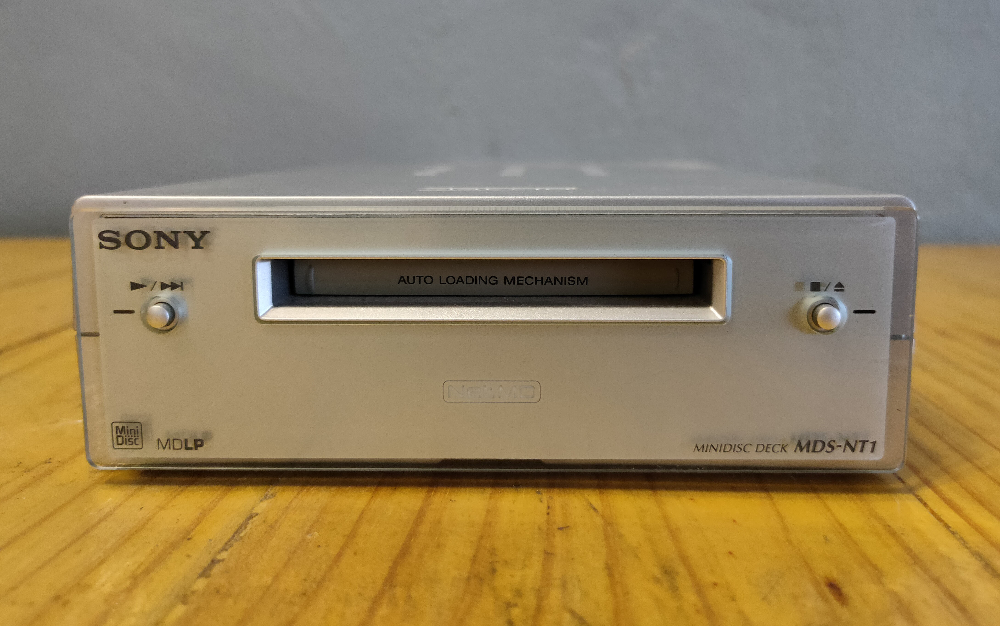
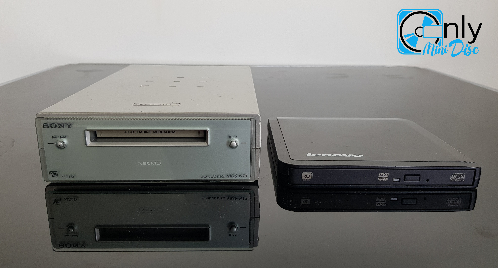
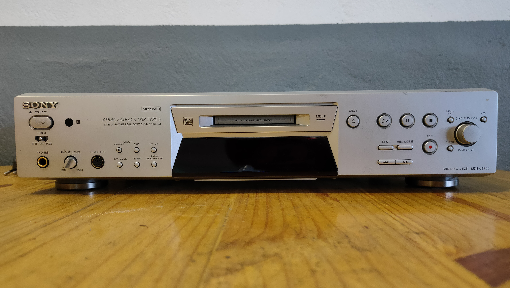
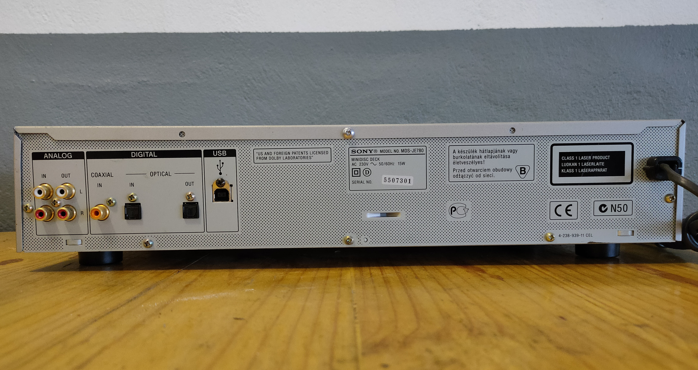
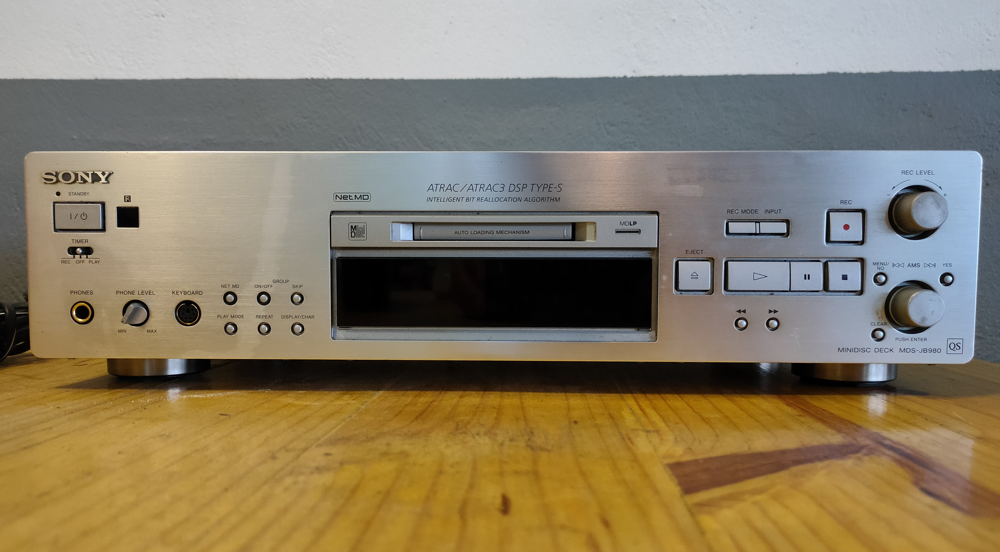
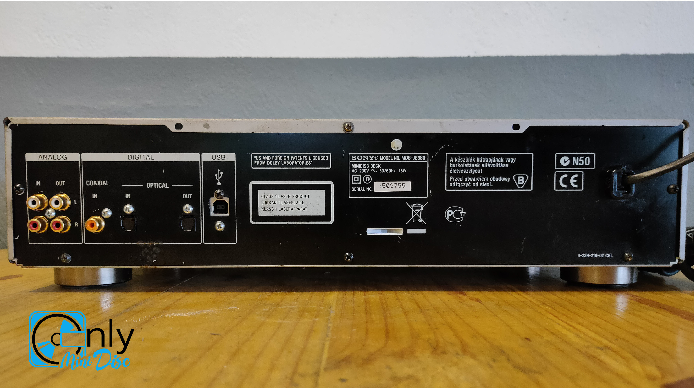
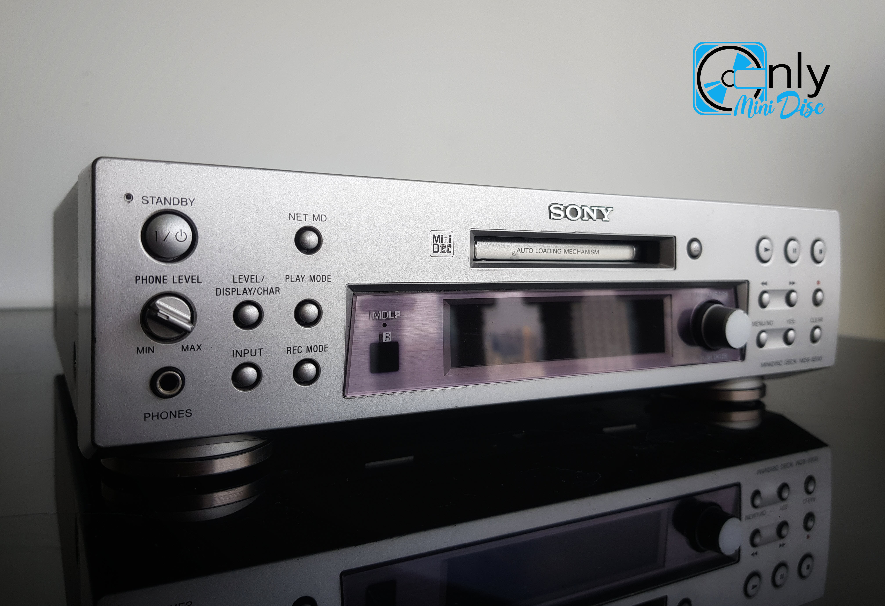
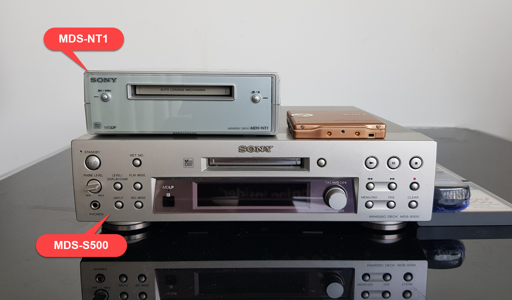
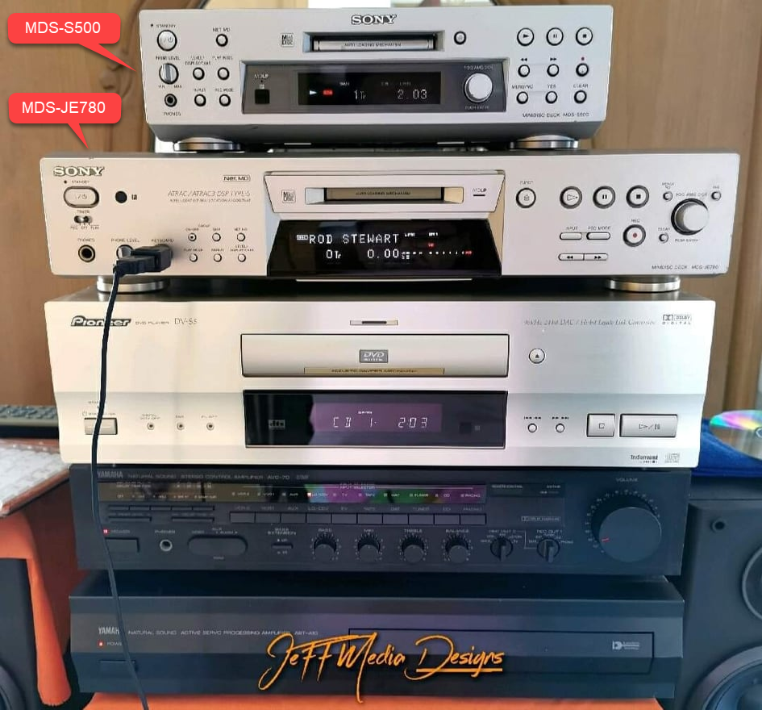

## Sony MDS-NT1
👇

Power adapter: Sony AC-96NP 9V 600mA

[More information on MiniDisc Wiki](https://www.minidisc.wiki/equipment/sony/deck/mds-nt1)

## Sony MDS-JE780
👇

- width x height x depth: 430mm x 95mm x 285mm
- [More information on MiniDisc Wiki](https://www.minidisc.wiki/equipment/sony/deck/mds-je780)

## Sony MDS-JB980
👇

- width x height x depth: 430mm x 108mm x 285mm
- [More information on MiniDisc Wiki](https://www.minidisc.wiki/equipment/sony/deck/mds-jb980)

## Sony MDS-S500
👇

- Remote control: Sony RM-D10J

[More information on MiniDisc Wiki](https://www.minidisc.wiki/equipment/sony/deck/mds-s500)

### Mini review of MDS S500

**จุดเด่น**
- รองรับ Net MD เขียนแผ่น MD จากเครื่องคอมพิวเตอร์ได้เลย
- รองรับ MDLP เล่นได้ทั้ง SP, LP2, LP4 mode
- คหสต สัมผัสได้ถึงพลังเสียงมากกว่า LAM-Z05
- ทนทานกว่าเครื่องเล่นแบบพกพา
- มี function MD เพียงอย่างเดียว ลดความซับซ้อนของกลไก
- เป็น deck ที่ขนาดไม่ใหญ่มาก วางในชั้นใต้ทีวีเล็กๆ ได้สบาย (กว้าง 280mm x สูง 82.5mm x ลึก300mm)
- เป็น Net MD deck ตัวสุดท้าย จริงมั่นใจได้ว่าสภาพเครื่องค่อนข้างใหม่

**จุดด้อย**
- ใช้เป็น DAC แบบรุ่น LAM-Z05 ไม่ได้
- ไม่เล็กกระทัดรัดเท่า LAM-Z05
- เปลี่ยนเป็น Net MD mode จาก remote control ไม่ได้

### MDS-S500 VS MDS-NT1

### MDS-S500 VS MDS-JE780

## Credit
- Players' images for reference only, not for commercial. Credit images from:
  - [Puwanai Mahachinorot](https://www.facebook.com/pinghitz)
  - [Jeff Phyakul](https://www.facebook.com/jeff.richy.52)

