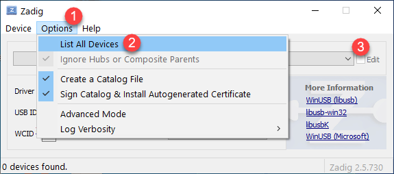
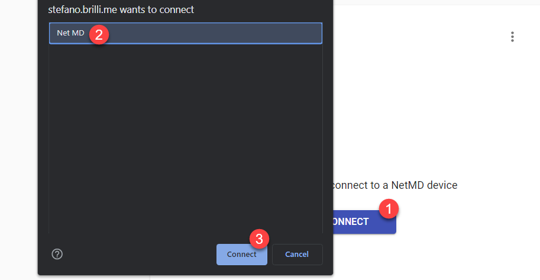
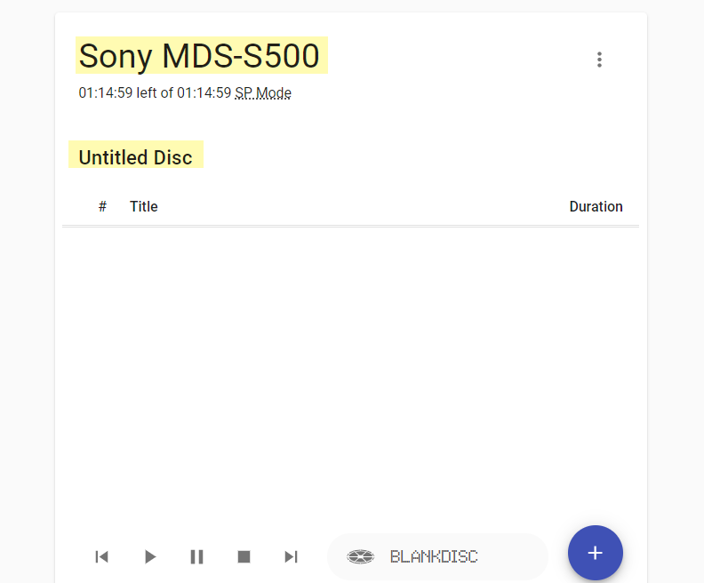

# Install driver 

- ดาวน์โหลดโปรแกรม Zadig [💾คลิกที่นี่เพื่อดาวน์โหลดโปรแกรม](files/zadig-2.5.zip)
- แตกไฟล์และดับเบิ้ลคลิก zadig.exe เพื่อเปิดโปรแกรมขึ้นมา
- โปแกรมจะถามว่าจะให้ตรวจสอบการอัพเดทหรือไหม่ สามารถคลิก No ไปก่อนได้ครับ

- รอจนหน้าต่างหลักของโปรแกรมแสดงขึ้นมดังรูปด่านล่างนี้

- ต่อเครื่องเล่น Net MD เข้ากับเครื่องคอมพิวเตอร์ผ่านสาย USB (สำหรับเครื่องเล่นแบบ Deck หรือ Bookshelf ให้เปลี่ยน mode ไปเป็น Net MD ก่อน)
- **สำคัญมาก** ในขั้นตอน สำหรับเครื่องคอมพิวเตอร์ที่ยังไม่เคยติดตั้ง Net MD ไดร์เวอร์มาก่อน ตัวโปรแกรมจะแสดงชื่ออุปกรณ์เช่น Net MD, Net MD Walkman ให้โดยอัตโนมัติ 

- แต่ถ้าไม่มีอุปกรณ์แสดงขึ้นมาให้
    - เลือก Options 
    - คลิก List All Devices 
    - เลือกหาอุปกรณ์ของเรา

- เมื่อได้เลือกอุปกรณ์ที่เชื่อมต่อกับเครื่องคอมพิวเตอร์เป็นที่เรียบร้อยแล้วให้ Install Driver กรณ์ที่ไม่เคยติดตั้งไดร์เวอร์มาก่อนหรือ Replace สำหรับเครื่องที่เคยติดตั้งไดร์เวอร์ไว้ก่อนแล้ว

- จะมีหน้าต่างแสดงขึ้นมาเพื่อบอกว่าเราได้ติดตั้งไดร์เวอร์เป็นที่เรียบร้อยแล้ว

# Use Web MiniDisc
ใช้งาน Web MiniDisc
- เปิดเบราว์เซอร์ แล้วไปที่ https://stefano.brilli.me/webminidisc/ 
- ที่เบราว์เซอร์จะแสดงหน้าแรกของ Web MiniDisc ขึ้นมา

- ใส่แผ่น MD ที่เราจะเขียนเพลงลงไป เข้าไปในเครื่องเล่น
- คลิกปุ่ม **CONNECT** > เลือกเครื่องเล่น > คลิกปุ่ม **Connect**

- Web MiniDisc จะแสดง
    - ชื่อเครื่องเล่นที่เชื่อมต่ออยู่ 
    - ชื่อแผ่น
    - รายชื่อเพลงทั้งหมดในแผ่น MD หรือแสดงเป็นแผ่นเปล่าถ้าไม่เพลงใดๆ เลย

- คลิกปุ่มสำน้ำเงินขนาดใหญ่ที่มุมล่างขวาขอจอเพื่อเลือกเพลงที่จะเขียนลงแผ่น MD (ตอนเลือกเพลงสามารถกดปุ่ม CTRL แล้วคลิกเพื่อเลือกหลายเพลงได้)

- เลือกโหมดในการอัดเพลงเป็น SP, LP2 หรือ LP4

- WebMini Disc ก็จะเริ่มแปลงเพลงของเราและทำการเขียนเพลงลงแผ่น MD

- รอ
- เมนู

