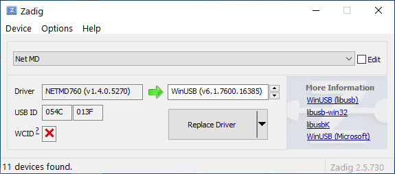
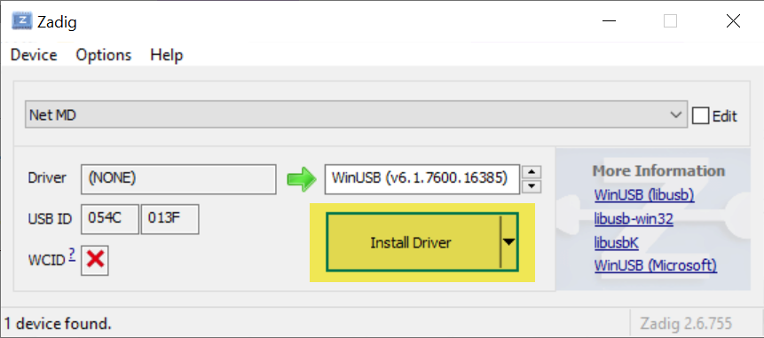

## Install a driver with Zadig
**This driver is requried for Windows only.** If you use Mac, Android or Linux, you don't need to install a driver and can skip to **"Use Web MiniDisc"** section.

- Download Zadig program. 👉 [💾Click here to download the program.](files/zadig.zip)
- Extract the file and double click **zadig.exe** to launch the program.
  The program will ask if you want to check for updates or not. You can click **No** to skip updating.
  

- Wait until the main window appears.
  

- Connect your Net MD recorder to a computer via USB cable (For Deck or Bookshelf recorders,
  please change to Net MD by pressing a Net MD button on a recorder).
- **!!! Very Important !!!** for a computer that has not previously installed a Net MD driver,
  the program will automatically display a device name such as Net MD or Net MD Walkman as in the following picture.
  

- If no device (Net MD or Net MD Walkman) is displayed, perform the following steps.
  1. Click **Options**.
  2. Click **List All Devices**.
  3. Click to select a device that is connected to the computer.
  

- Once a connected Net MD recorder has been selected, do either:
  - Click the **Install Driver button** for computers that have never installed the driver
  

  - Click the **Replace Driver** button (for computers that have previously installed the driver). already)
  

- A window will appear after the driver has been successfully installed.
  

## Use Web MiniDisc on a computer
Use Web MiniDisc single page app. This application requires internet connection only the first time that you open it. It does not upload your music files to a server.
Everything is done on your computer.

- Open a browser (Chrome or Edge) and navigate to https://webminidisc.com or https://stefano.brilli.me/webminidisc/.
- A browser will display the homepage of the Web MiniDisc app.
  

- Insert an MD that we are going to write a song into a recorder and perform the following steps:
  1. Click the **CONNECT** button.
  2. Click the connected device which can be **Net MD** or **Net MD Walkman**.
  3. Click the **Connect** button to select a connected device.
  

- Web MiniDisc will display:
  - Name of the connected player
  - MD title
  - List of all songs on the MD disc, or show blank if there are no songs at all
  

- Click the big blue button in the bottom right corner of the screen.
  Select a song to write to an MD.
  Optionally, you can hold the **CTRL** key and click to select multiple music files.
  

- After music files has been selected, a recording setting screen will show up and you can adjust some settings:
  1. Select a recording mode such as **SP**, **LP2** or **LP4**.
  2. Specify the song title from which information such as filename, song's title.
  3. Press the OK button to write selected songs to an MD.
  - Optionally, we can press the **SHOW TRACK** button to display a list of all selected songs or add more songs before writing a disc.
  

- Web MiniDisc will start converting the selected songs and writing them to an MD disc.
- Optionally, you can check **Notify when completed** to let the program notify you when writing has finished.

- Wait until Web MiniDisc has written all selected songs to the MD disc.
- Then click the three little dots in the upper-right corner of the screen, and click **Exit** to exit Web MiniDisc.
- Disconnect a USB cable a computer and an MD recorder.
- You can now start playing songs on a disc by your MD player/recorder.

## Use Web MiniDisc on a mobile phone
- You can only use it on Android phones with Chrome or Edge mobile browser. It does not support iOS, so you can't use it on iPhone or iPad.
- We can use Web MiniDisc to write a music file to an MD via mobile phone directly with Net MD compatible recorders.
- It does not require to install a driver.
- Use any USB OTG adapter or USB type C to mini USB to connect your mobile phone to a recorder.
- You can select a single song or all the songs in a folder to write mulitple songs to an MD.
- Perform the following steps to to write an MD with your mobile phone.
  1. Press the **+** button to select a song to write to an MD.
    

  2. Select **Files** action.
    

  3. Select a folder where music files are stored.
  4. You can also select all files at once.
    

  5. Press the **OPEN** button to select all files to write to a disc.
    

  6. Select a Recording mode.
  7. Press the **OK** button to write selected files to a disc.
    

  - Wait until the Web MiniDisc has finished writing a disc.
  - Optionally, you can check **Notify when completed** to let the program notify you when writing has finished.
    

- Enjoy
  

## Supported music files
List of supported files that we can use in Web MiniDisc app

| File extension | File name                                        | Developer                    |
|----------------|--------------------------------------------------|------------------------------|
| *.opus         | Opus Audio File                                  | Xiph.Org                     |
| *.flac         | Free Lossless Audio Codec                        | Xiph.Org                     |
| *.webm         | WebM Video                                       | Google                       |
| *.weba         | WebM Audio File                                  | Google                       |
| *.wav          | WAVE Audio File                                  | Microsoft & IBM              |
| *.ogg          | Ogg Vorbis Audio File                            | Xiph.Org                     |
| *.m4a          | MPEG-4 Audio File                                | Apple                        |
| *.oga          | Ogg Vorbis Audio File                            | Xiph.Org                     |
| *.mid          | MIDI File (Musical Instrument Digital Interface) |                              |
| *.mp3          | MP3 Audio File   (Layer 3 audio compression)     | Moving Picture Experts Group |
| *.aiff         | Audio Interchange File Format                    | Apple                        |
| *.wma          | Windows Media Audio File                         | Microsoft                    |
| *.au           | Audacity Audio File                              | Audacity                     |
| *.m4v          | iTunes Video File                                | Apple                        |
| *.mp4          | MPEG-4 Video File                                | Moving Picture Experts Group |

## Hi-MD players/recorders
- Hi-MD recorders that support Net MD can also be used with Web Minidisc.
- Supported models are as follows: Sony CMT-AH10, Sony LAM-X1, Sony MZ-DH10P, Sony MZ-NH1, Sony MZ-NH3D, Sony MZ-NH600 / MZ-NH600D / MD-HUSB, Sony MZ-NH700 / MZ- NHF800, Sony MZ-NH900, Sony MZ-RH1 / MZ-M200, Sony MZ-RH10 / MZ-M100, Sony MZ-RH710 / MZ-DH710, Sony MZ-RH910 / MZ-M10

## Note for using Web Minidisc with Hi-MD recorders
- We can't use write a normal disc in Hi-MD mode.
- It is not compatible with Hi-MD discs.
- It supports only SP, LP2, LP4 mode and normal MD discs.
- It is possible that a driver installed with Zadig have issues with Windows OS and Hi-MD recorders. It is recommended to use Linux, mobile phones, or Mac as they do not require a driver to be installed.

## Credit & Reference
- [Puwanai Mahachinorot](https://www.facebook.com/pinghitz) who recommended Web MiniDisc to me.
- [Using Web MiniDisc from MiniDisc Wiki](https://www.minidisc.wiki/guides/webminidisc)
- Test music files from YouTube Audio Libary
- [Eddie Chan](https://www.facebook.com/eddie.chan.942) who corrected my English grammar for this user guide.
