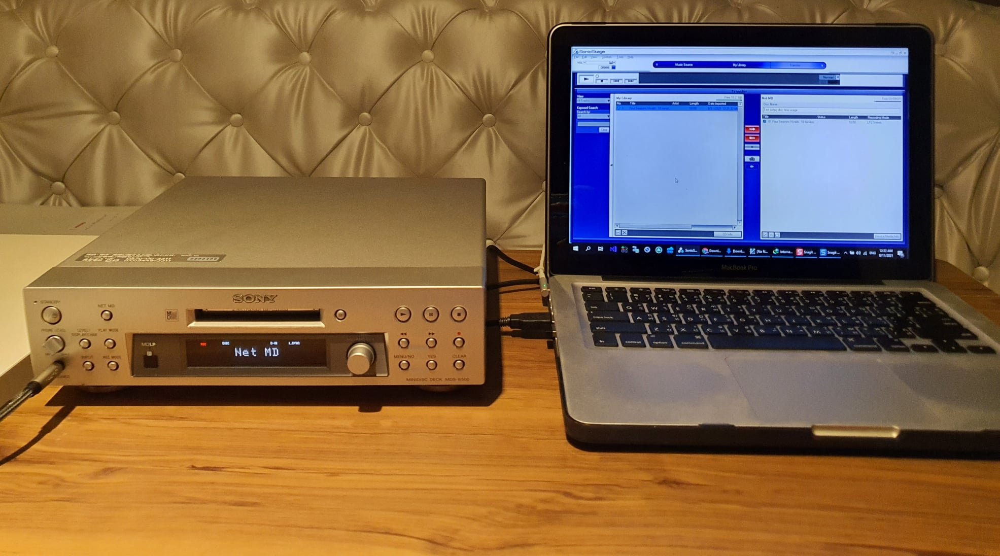
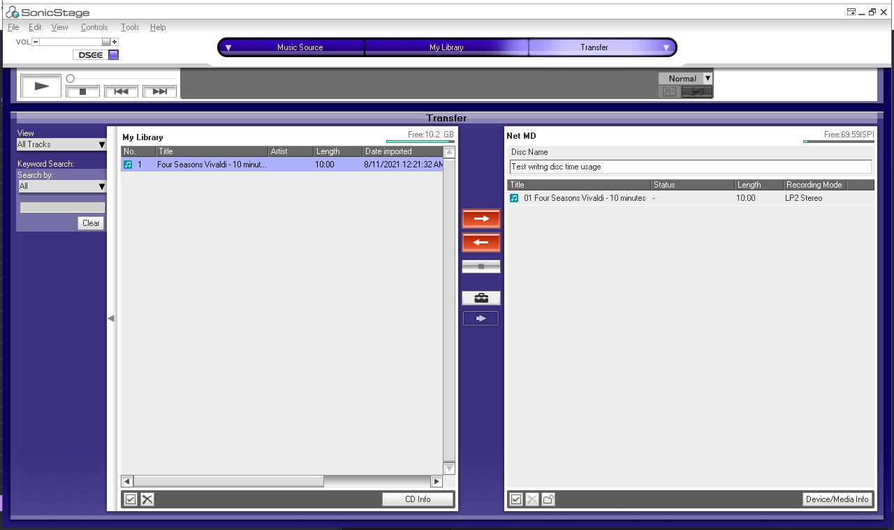

ทดสอบเวลาที่ในการเขียนเพลง MP3 ลงแผ่น MD ด้วยเครื่องเล่น Net MD และโปรแกรม SonicStage

## Input
ข้อมูลที่ใช้ทดสอบ

- ชื่อเพลง: Four Seasons Vivaldi
- ความยาว: 10 นาที (ตัดมาพอดี 10 นาที)
- ชนิดของไฟล์: MP3 320 kbps
- เครื่องเล่นที่ใช้: Sony MDS-S500 แบบ deck
- เครื่องคอมพิวเตอร์ที่ใช้:
  - CPU: Intel(R) Core(TM) i5-3210M CPU @ 2.50GHz, 2501 Mhz,
    2 Core(s), 4 Logical Processor(s)
  - RAM: 16.0 GB
  - HDD: Samsung SSD 860 EVO 256GB
  - OS: Windows 10, Version	10.0.19042 Build 19042

## Result
ผลการทดสอบเป็นดังนี้

| recording mode | file format                                | bit rate (kbps) | เวลาที่ใช้โดยประมาณ     |
|----------------|--------------------------------------------|-----------------|------------------|
| SP             | ATRAC (Adaptive Transform Acoustic Coding) | 292             | 3 นาที 12 วินาที |
| LP2            | ATRAC3                                     | 132             | 45 วินาที        |
| LP4            | ATRAC3                                     | 66              | 45 วินาที        |

> SP ใช้เวลานานสุดคือ ~3 นาที 12 วินาที

> LP2 และ LP4 ใช้เวลาเท่ากัน ~45 วินาที

**เวลานี้รวมการ convert file โดย SonicStage ไปเรียบร้อยแล้ว**

คหสต ผมอาจจะไม่สายเสียง hi-end แต่คิดว่า LP2 น่าสนใจมากๆ เพราะว่า:
- คุณภาพเสียงที่ดียอมรับได้ ลดไป ~ 20%
- เวลาที่ใช้ในการเขียนที่ไวมาก เพลงที่มีความยาว 10 นาที (600 วินาที) ใช้เวลาในการเขียน ~45 วินาที
  ถ้าคิดแบบเส้นตรง เพลงโดยทั่วไปที่มีความยาว 3 นาที (180 วินาที) จะใช้เวลาเขียนเพียง 180 * (45/600) = 13.5 วินาที
- หนึ่งแผ่น MD ถ้าเขียนเป็น LP2 mode จะเก็บเพลงได้เป็นสองเท่าของ SP mode

