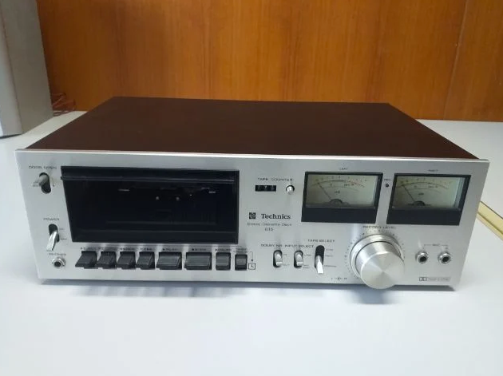
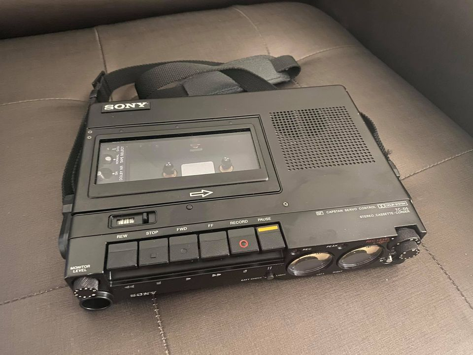
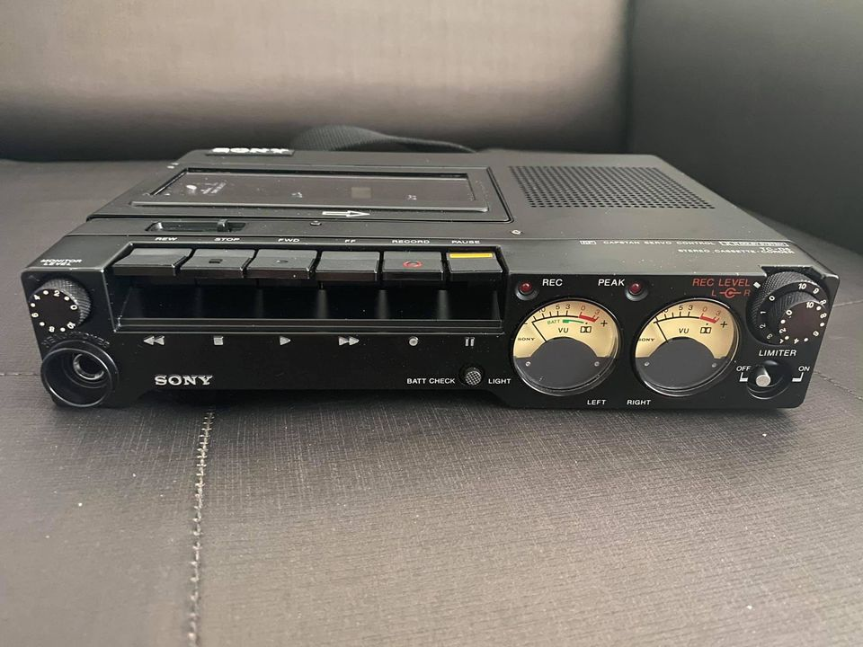
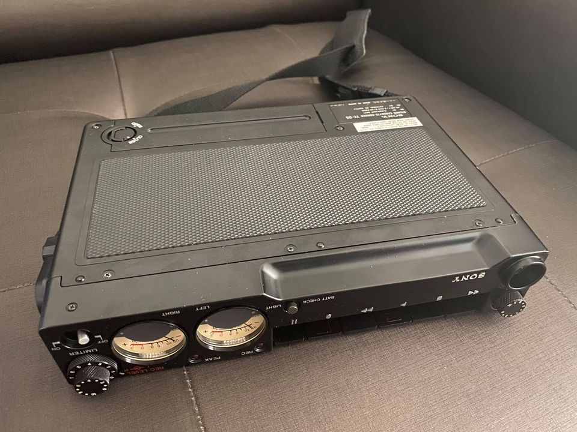
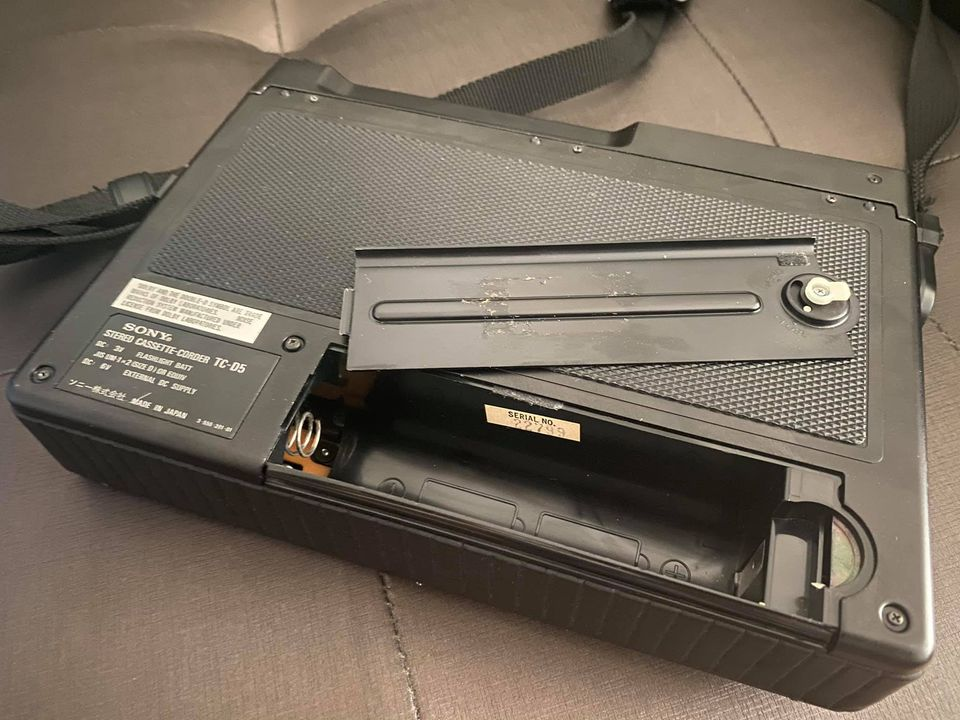
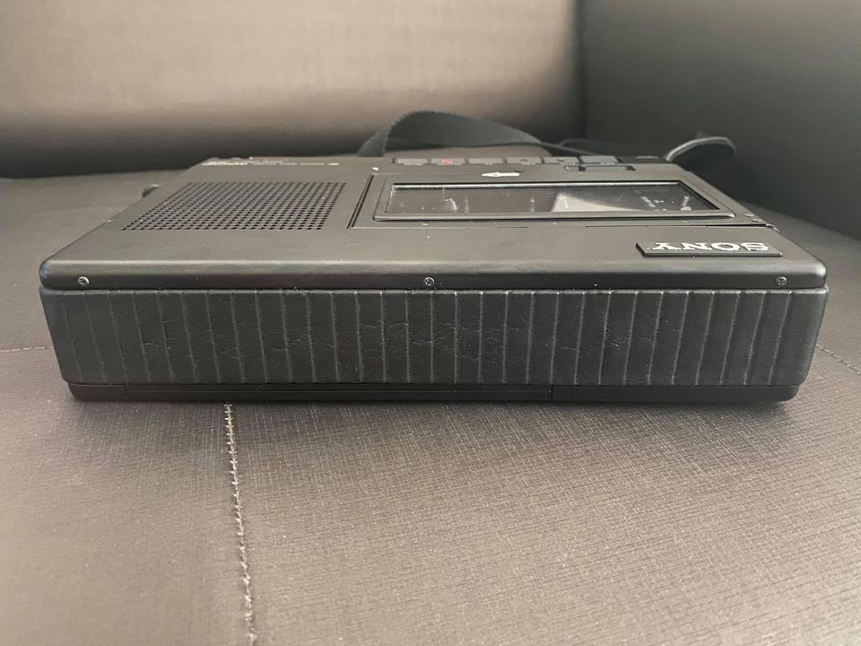
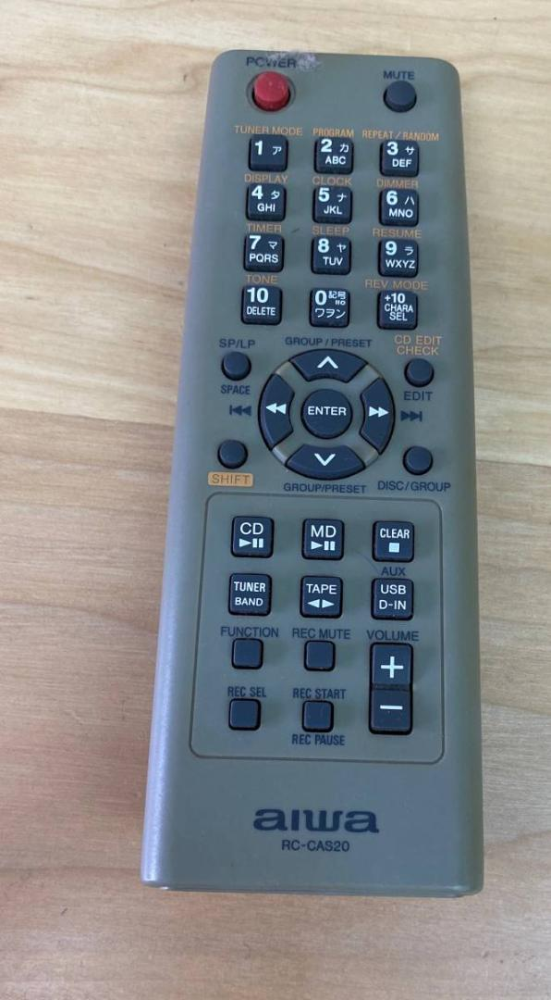

##  Technics Stereo cassette deck 615
👇

## Sony TC-D5/TC-D5M
👇

👉👉[Sony TC D5 Pro II the most extraordinary portable deck](http://www.walkman-archive.com/wa/2012/06/sony-tc-d5-pro-ii-the-most-extraordinary-portable-deck/)

## Sony TC-2850
👇

## Sony TC-153SD
👇

## Technics​ RS-265U
👇

## Victor KD-110
👇

## Aiwa XR-FD55
👇

Remote control - Aiwa RC-CAS20

## Panasonic CQ-VX5500
👇

# Credit
- Players' images for reference only, not for commercial. Credit images from:
  - Yahoo Auction Japan
  - ebay
  - Chalermphol
  - [Krissada](https://www.facebook.com/kiffheavyfamily/)
  - [Pakpoom Ruentongdee](https://www.facebook.com/PAKPOOM45)
  - [Panasonic CQ-VX5500 MiniDisc & CD Double Din with VU meters video from CassetteMD channel](https://www.youtube.com/watch?v=_WBjpiYBdSw)
