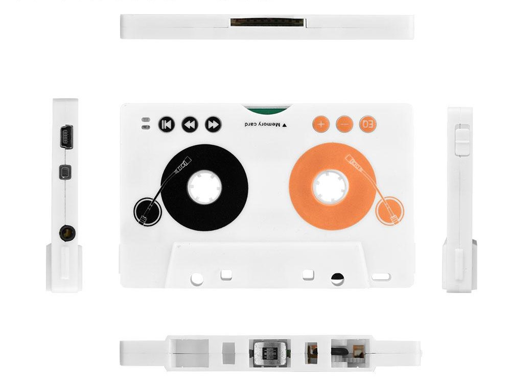

## Feature & Instruction

- ตัวตลับเทปมีแบตในตัว เสียบชาร์จได้เลย ขั้วจะเป็น mini usb กับ micro usb แล้วแต่รุ่น
- ใช้ได้ไฟล์ MP3 ถึง 320kbps และ Wave 16bit/44.1 kHz
- เก็บไฟล์ใน  Sd card ไม่ใช่ micro sd ถ้าจะใช้  micro SD ให้ใช้ร่วมกับ SD card adapter
- เลื่อนเปิดที่ปุ่ม power ในตลับเทปก่อน แล้วค่อยใส่เข้าไปในเครื่องเล่นเทป
- ตัวเทปจะเล่นเพลงไปเรื่อย ๆ จนหมดแบตที่ชาร์จไว้
- ใช้ได้กับ SD card ขนาด 64GB (ทดสอบแล้ว)
- มีรีโมทมาให้มาสำหรับ play/pause/next/previous/preset EQ และที่ตัวตลับเทปมีปุ่มให้ปรับเหมือนรีโมทด้วย
- ตลับเทปมี 3.5 jack เสียบหูฟัง ใช้เป็น MP3 player ได้เลย

## Mini review
- เนื่องจากฟังจากเครื่องเล่นเทป เครื่องเล่นเทปที่ดีก็ทำให้ได้เสียงที่อยู่ในระดับเป็นที่น่าพอใจ
- ตอบโจทย์ในการไม่ต้องไปหาตลับเทป master และบางเพลงหาไฟล์เสียงง่ายกว่าการหาตลับเทป
- มีผลกระทบจากการใช้งานต่อหัวเทปเพียงเล็กน้อย
- เครื่องเล่นเทปไม่ต้องมี auto reverse เหมือนมี auto reverse ในตัว
- เล่นได้เป็นพันเพลงๆ หรือจนกว่าแบตจะหมด

## Credit
- คุณ Cheevin Phiboon สำหรับข้อมูลที่มีประโยชน์จากผู้ใช้งานจริง
